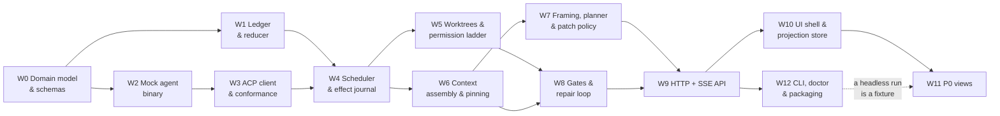

# Roadmap: M0 → M3

> Part of the [Karvan architecture documentation](./README.md). See also: [PRD](./prd.md) ·
> [Architecture overview](./01-architecture-overview.md) · [Research findings](./research-findings.md)

**Status:** Draft v1.0 · **Last reviewed:** 2 August 2026

---

## 0. What this document is, and how it differs from PRD §11

PRD §11 sketched four milestones before any of the technology had been touched. This document
re-derives the same sequence against research that was empirically executed on 2026-08-02 —
packages installed, five agent binaries probed over the wire, SQLite benchmarks run, process
trees killed and inspected. Three things changed materially:

1. **M0 grew.** The PRD's spike had two items. The research found five more assumptions that are
   cheap to test now and expensive to discover in month three. All seven are below.
2. **M1 got a critical path.** A flat list of F-numbers is not a build order for one person. §2
   turns it into twelve workstreams with explicit dependencies, so that at any point there is
   exactly one thing to work on next.
3. **The nine P0 views are questioned.** Not overruled — questioned, with a recommendation (§3).

Nothing here changes the [locked architectural decisions](./01-architecture-overview.md#2-the-inviolable-rules).
Where the research contradicted the PRD, the correction is recorded in
[research-findings.md](./research-findings.md) and reflected in the relevant architecture doc.

---

## 1. M0 — the spike

**Target: 8–10 working days.** Nothing in M0 is production code. Every spike is a throwaway
directory with one question, one success criterion, and permission to fail.

The rule for M0: **a spike is done when it has produced either a working command you can re-run,
or a written reason why the plan changes.** A spike that ends in "seems fine" has not run.

### S1 — ACP round trip, end to end (L, 3–4 days)

**The single riskiest unverified assumption in the whole project.**

The research verified `initialize` handshakes live against all five ACP entry points —
`@agentclientprotocol/claude-agent-acp@0.64.1`, `@agentclientprotocol/codex-acp@1.1.9`,
`opencode acp` (1.18.11), `copilot --acp` (1.0.77), `gemini --acp` (0.53.1) — and confirmed all
five negotiate wire `protocolVersion: 1`. **Verified 2026-08-02.** It did **not** complete a full
prompt cycle against any of them, because that consumes vendor credits and needs each vendor's
auth. So streaming, permission prompts, and cancellation are **design-verified from the SDK types
and the shipped schema, not runtime-verified**. **Unverified.**

Run against two agents: `claude-agent-acp` (the adapter path, because Claude Code does not speak
ACP natively — verified absent from `claude --help` v2.1.220) and one native-ACP agent
(`gemini --acp` is the cheapest to authenticate).

**Success criterion.** For each of the two agents, a single script completes:

| Step | What must be observed |
|---|---|
| `initialize` | `protocolVersion: 1`, capabilities recorded to a fixture file |
| `session/new` | Session id returned; Karvan's stdio MCP server accepted in `mcpServers` |
| `session/prompt` | Prompt accepted |
| `session/update` | **At least three** streamed notifications arrive incrementally, not in one burst at the end |
| `session/request_permission` | The client is actually asked, and a `reject_once` is honoured |
| `session/cancel` | Prompt response returns `stopReason: 'cancelled'` **and** the client keeps accepting the trailing `session/update` notifications the agent flushes afterwards, without deadlocking |

Two extra questions to answer while the harness is warm, both flagged as open risks by the research:

- **Does ACP surface token usage or compaction at all?** If it does not, the ACP-first path
  silently costs F9.1 and F10.5, which is a significant and non-obvious trade. Check explicitly.
- **Is `structured_output` actually populated on success?** The Claude Code result-envelope zod
  schema was read from the shipping bundle, not exercised. F6.9 depends on it.

Also confirm the two verified footguns hold in your harness: `--verbose` is required alongside
`claude -p --output-format stream-json` (without it the process exits with an error), and the SDK's
`LineBuffer` has no maximum line length, so an agent that never emits `\n` will OOM the daemon.
Impose your own cap.

**Deliverable:** the capability probe becomes the first version of the
[capability matrix fixture](./07-provider-adapter-layer.md) — a generated file, never a constant.

### S2 — the zero-build dev loop (S, 0.5 day)

The dev story in [03-local-development.md](./03-local-development.md) rests on running
`node packages/daemon/src/main.ts` with no build step, importing sibling workspace packages that
publish `exports: './src/index.ts'`. Node **refuses to type-strip `.ts` files resolved inside
`node_modules`**, and pnpm workspace links *are* symlinks in `node_modules`. Node normally resolves
the realpath first, which should make it work — but this was **reasoned about, not executed**.
**Unverified.** It is the one load-bearing assumption in the entire dev loop.

**Success criterion.** Two throwaway packages, `a` importing `b`, `b` with
`exports: './src/index.ts'`, `pnpm install`, then `node a/src/main.ts` prints from `b` — on **both
Node 24 and Node 26**, with `erasableSyntaxOnly` syntax only. If it fails, the fallback is
`tsx@4.23.4` in watch mode and the dev-loop doc changes before it is written into muscle memory.

Half a day. Do this one first — it is the cheapest and it gates how every other spike is written.

### S3 — elkjs in a Vite 8 worker (M, 1 day)

`elkjs@0.12.0` is GWT-transpiled Java. Its own README acknowledges bundler friction, and its
documented `workerUrl` option assumes a publicly-served path that does not survive Vite's asset
hashing. The plan is Vite's `?worker` import plus ELK's `workerFactory`. **Unverified** — the
research could not run a build.

**Success criterion.** A `vite build` (not just `vite dev`) of a scratch app that lays out a
60-node graph off the main thread, where: the worker chunk is emitted and hashed correctly, ELK
(~1.6 MB) is **absent from the initial chunk**, and the same code path works from the built
`dist/` served by the daemon — not only from the dev server.

**Fallback if it resists:** `@dagrejs/dagre@3.0.0` for the live graph, and ELK on the main thread
only for the scrubber's cached layouts, where a slower synchronous call is acceptable. Note the
Vue Flow docs' repl pins `@dagrejs/dagre@1.1.2`, two majors behind 3.0.0, so copied example code
targets an older API surface.

While here, also settle the layout-pinning question. The
`layerChoiceConstraint` / `positionChoiceConstraint` recipe **will not work as commonly written**:
those options are consumed only when `org.eclipse.elk.interactiveLayout=true`, `semiInteractive`
reads `org.eclipse.elk.position` rather than `positionChoiceConstraint`, and constraint enforcement
is a known elkjs weak spot. **The union-graph-laid-out-once approach is the primary mechanism for
the plan scrubber** (F10.2); the interactive constraints are an experiment, not a load-bearing
design. Prove the union-graph approach here, on a synthetic 5-version plan.

### S4 — Vite middleware mode inside karvand (M, 1 day)

D10 puts Vite in middleware mode inside the daemon: one process, one port (7777), no proxy, no
CORS. This is forced, not chosen — Vite's dev proxy is documented-bad at SSE (events buffer and
arrive in one burst at stream end, long streams hit socket timeouts, close events do not propagate
back to the backend), and the entire UI is an SSE projection of the ledger.

**Success criterion.** One `node` process on port 7777 that simultaneously: streams an SSE endpoint
emitting one event per second for **ten minutes** with events arriving individually (measured by
client-side timestamps, not by eyeball), and hot-reloads a `.vue` edit over the same port without
dropping the SSE connection. Confirm no compression middleware sits in front of the SSE route, and
that `X-Accel-Buffering: no` and `Cache-Control: no-cache, no-transform` are set.

Second half of the same day: verify the resume contract. `EventSource` sends `Last-Event-ID` **only
on automatic reconnect**, never on a fresh `new EventSource()` after a page reload, and it cannot
set custom headers at all. **Verified 2026-08-02.** So the endpoint must also accept `?since=<seq>`.
Test by reloading the page mid-stream and confirming no events are lost.

### S5 — better-sqlite3 prebuilds on the author's macOS machine (S, 2 hours)

`better-sqlite3@13.0.2` migrated to N-API in v13 and ships 8 prebuilt binaries directly in the npm
tarball (`prebuilds/{darwin,linux,linuxmusl,win32}-{x64,arm64}.node`), with `gypfile: false` and
**no install script**. `npm i` completed in **1 second** with zero compilation. **Verified
2026-08-02 — on linux-x64 only.** The darwin binaries are demonstrably in the tarball but were
never executed.

**Success criterion.** On the author's actual laptop: `npm i better-sqlite3@13.0.2` with no
compilation, `SELECT sqlite_version()` returns `3.53.4`, an FTS5 table creates and `bm25()` ranks,
and `db.loadExtension` is present.

Then re-run the append benchmark on APFS. Every fsync-sensitive number in
[05-durable-execution.md](./05-durable-execution.md) — 979 ev/s at `synchronous=FULL` versus
22,982 ev/s at `NORMAL` — was measured on Linux, likely on overlayfs. macOS uses `F_FULLFSYNC` and
is typically **slower** for fsync. The relative shape (FULL ~20–25× more expensive per commit,
batching ~7×) should hold, but pick the `synchronous=` setting from numbers measured on the machine
that will run it.

### S6 — `@lydell/node-pty` prebuild coverage (S, 0.5 day)

This is **the single remaining native-install risk for `npx karvan up`** (NF6). Upstream
`node-pty@1.1.0`'s install script is `node scripts/prebuild.js || node-gyp rebuild` — it silently
falls back to compiling, and was **verified to fail outright** in a toolchain-less environment.
`@lydell/node-pty` uses per-platform npm `optionalDependencies` and installed in **514 ms with zero
compilation**. **Verified 2026-08-02.** But it is at `1.2.0-beta.14` — a beta of a community fork.

**Success criterion.** An install matrix: macOS (Apple Silicon, and Intel if relevant) × Linux
(glibc and musl) × Node 24 and Node 26, each producing a working `/dev/pts` allocation with no
compiler on the box. Anything missing from the matrix becomes a documented prerequisite or a
no-TTY fallback path.

Note: **no agent process needs a TTY.** ACP and all headless modes are pure pipe protocols,
verified across five agents. A pty is needed only for Karvan's own ACP `terminal/*` implementation
— so the fallback (`terminal/*` unavailable, capability not advertised) is survivable, not fatal.

### S7 — Biome's Vue formatter on real SFCs (S, 2–3 hours)

Biome's `.vue` support is not merely "experimental" — it is **off by default**, gated behind
`"html": { "experimentalFullSupportEnabled": true, "formatter": { "enabled": true } }` in
`biome.json`. Without that flag `biome check` **silently no-ops on `.vue` files**. That silence is
the hazard: a pre-commit hook with `stage_fixed: true` that quietly does nothing is worse than no
hook.

**Success criterion.** `biome check --write` on a scratch branch against a handful of real SFCs —
specifically `<script setup>` with complex generics, and templates with long attribute lists — with
the diff read by eye and `git diff --stat` bounded. Only then wire it into the hook.

While here, confirm the ownership split: Biome formats, `oxlint` lints, enforced with
`files.includes`. Running both linters over the same files produces duplicate diagnostics and
fighting autofixes. Type-aware linting went stable in **oxlint 1.75.0** (1.76.0 is merely the
current latest). And oxlint lints only the `<script>` block of `.vue` files and will never
implement `eslint-plugin-vue` template rules — if you need `vue/no-unused-components`, that needs
ESLint, which is a separate decision.

### M0 summary and the kill criterion

| Spike | Question | Size | Blocks |
|---|---|---|---|
| S1 | Does a full ACP prompt/stream/permission/cancel cycle work? | L, 3–4 d | Everything |
| S2 | Does the zero-build dev loop actually run? | S, 0.5 d | All other spikes |
| S3 | Does elkjs build in a Vite 8 worker? | M, 1 d | F10.1, F10.2 |
| S4 | One port, SSE + HMR, ten minutes clean? | M, 1 d | The whole UI |
| S5 | Do the SQLite prebuilds load on macOS, and at what fsync cost? | S, 2 h | The ledger's durability setting |
| S6 | Does `@lydell/node-pty` cover the platform matrix? | S, 0.5 d | ACP `terminal/*`, `npx karvan up` |
| S7 | Does Biome format Vue without lying about it? | S, 2–3 h | The commit hook |

> **Kill criterion (restated and sharpened).** If S1 shows that ACP integration is impractical —
> the adapters cannot complete a prompt cycle reliably, permission mediation does not actually
> reach the client, or cancellation deadlocks — **and** CLI exec shims prove hopelessly unstable
> across two vendors, then the provider-neutrality thesis needs rethinking before anything else is
> built. That is the point at which to stop.
>
> Two clarifications the research adds. First, ACP adapters for Claude Code and Codex are
> **community-maintained bridges, not first-party vendor implementations** — their fidelity to the
> underlying CLI is the main risk to the ACP-first thesis, so S1 must test the *adapters*, not just
> the natively-ACP agents. Second, the PRD's separate worry that "ACP fragments because Microsoft
> ships a competitor" has **largely retired**: Microsoft shipped Intelligent Terminal 0.1 on
> 2 June 2026 with a native agent pane speaking ACP that auto-detects Copilot, Claude Code, Codex
> CLI and Gemini CLI, and Microsoft's `agent-host-protocol` (AHP) is explicitly positioned as
> **complementary** — "AHP is a coordination layer. ACP is a communication layer. They compose
> naturally" — with AHP hosts speaking ACP downstream. The remaining ACP risk is adapter fidelity
> and v2 timing, not standards fragmentation.

None of the other six spikes is a kill criterion. Each has a stated fallback; the point of running
them in M0 is that the fallback costs a day now and a fortnight later.

---

## 2. M1 — the personal tool

**Definition of done (restated from PRD §11, unchanged):**

> **You complete a real multi-hour task at work with it, from spec to merged PR, and the
> visualisation tells you why every step happened.**

Everything below serves that sentence. Anything that does not is M2.

### 2.1 The critical path

The shape that matters: **W1 before everything, because everything is a projection of the ledger**;
**W2 before W3, because the mock binary is what makes the ACP client testable without spending
credits**; and **W9 before any UI work**, because a view built against a hand-rolled fixture will
be rebuilt against the real stream.

### 2.2 The workstreams

| # | Workstream | PRD requirements | Architecture doc | Depends on |
|---|---|---|---|---|
| W0 | **Domain model & schemas.** `TaskSpec`, `PlanGraph`, `PlanPatch`, `Fact`, `ContextPacket`, the `Event` union with an explicit `v` field and upcasters. Stable, never-reused `nodeId`s as a schema invariant. | F2.1, F2.3, F6.2, F6.3 | [04](./04-domain-model.md) | — |
| W1 | **Ledger, reducer, `Db` port.** Append-only SQLite with `INTEGER PRIMARY KEY AUTOINCREMENT`, WAL, one write connection + N read-only, `busy_timeout` on all. Reducer is pure. Separate `io_chunk` table from the control-plane `event` table. `flock` on the DB directory + `daemon_epoch` on every write. | F4.1, F4.2, NF9, NF10 | [05](./05-durable-execution.md) | W0 |
| W2 | **Mock agent binary** (`@karvan/mock-agent`, D17). A real executable on `PATH` speaking ACP, scriptable to produce structured output, streaming, permission refusal, timeout, cancellation, non-zero exit, malformed output. A mocked `child_process` tests the mock; this tests the subprocess boundary. | F3.7 | [07](./07-provider-adapter-layer.md), [14](./14-testing-strategy.md) | W0 |
| W3 | **ACP client, adapters, capability manifest, conformance suite.** `@agentclientprotocol/sdk@1.3.0` pinned exact, wire version 1. Capability manifest per adapter including `supportsResume` and `tokenAccounting: 'exact' \| 'estimated' \| 'none'`. Conformance battery targets the **adapters**, not only the CLIs. CLI exec shims as the documented fallback. | F3.1–F3.6 | [07](./07-provider-adapter-layer.md) | W2, S1 |
| W4 | **Scheduler, effect journal, durable wake.** Idempotency keys `(run_id, node_id, attempt)`; crash-resume (same attempt → memoise) and failure-retry (new attempt → re-execute) are **different operations**. `node_wake` table + 1 Hz ticker — never `setTimeout`, whose max delay is 2^31−1 ms and which fires after 1 ms on overflow. Budget ceilings that pause. No-progress detection. | F4.3–F4.7, F9.2 | [05](./05-durable-execution.md) | W1, W3 |
| W5 | **Worktrees, git, permission ladder, kill switch.** Flat branch naming `karvan/<runId>__<nodeId>` (D13). `git merge-tree --write-tree` as conflict ground truth (D14); path scopes demoted to plan-time prediction. Four-level ladder enforced at the ACP `fs/*` and `terminal/*` boundary. `detached: true` + `process.kill(-pid, sig)`, filtering zombie state when verifying. | F5.1–F5.7 | [09](./09-workspace-and-safety.md) | W4 |
| W6 | **Context assembly, pinning, compaction, token accounting.** Four tiers. Pinned set never compacted, re-injected verbatim. Compaction events carry a `fidelity: 'exact' \| 'partial'` discriminator, because vendor-internal compaction does not give you both numbers. Self-calibrating token ratio. FTS5 with `tokenize = "unicode61 remove_diacritics 2 tokenchars '_-.'"` — set at table creation, unchangeable later. | F6.1–F6.6, F9.1 | [08](./08-context-and-memory.md) | W4 |
| W7 | **Framing interview, planner, patch policy engine.** `TaskSpec` gate before execution. Planner compiles spec + recon + capability list into `PlanGraph` v1. Patches auto-applied / queued / rejected by declarative rules. Every plan version retained. | F1.1–F1.3, F2.1–F2.6 | [06](./06-planning-and-replanning.md) | W6 |
| W8 | **Gates and the repair loop.** Deterministic gates first. Adversarial review on a **different session and preferably a different provider**. Typed verdicts with evidence. Surgical repair, capped at 3, then escalate. Acceptance-criteria traceability. | F7.1–F7.5, F8.1–F8.3 | [10](./10-verification-gates.md) | W5, W6 |
| W9 | **HTTP + SSE API and auth.** Exactly **one multiplexed SSE endpoint per tab** with a topic field per frame — HTTP/1.1 caps ~6 connections per origin and browsers require TLS for HTTP/2, so h2c on localhost is not available. Resume via `Last-Event-ID` **and** `?since=<seq>`. Bearer token + `Origin` validation from the first commit. | F4.4, NF3, NF10 | [11](./11-api-and-realtime.md), [15](./15-security-model.md) | W7, W8 |
| W10 | **UI shell and the ledger-projection store.** Hand-rolled projection store on Pinia 4 (D11). `shallowRef`/`shallowReactive` for collections, `markRaw` for anything handed to Vue Flow, xterm or ELK. Apply-and-drop events; keep a bounded ~2,000-event debug ring, never the raw array. Server-side snapshots for scrubber replay, never client-side replay from seq 0. | NF3 | [12](./12-frontend-architecture.md) | W9 |
| W11 | **The P0 views**, in the priority order argued in §3. | F10.1–F10.9 | [12](./12-frontend-architecture.md) | W10 |
| W12 | **CLI, `doctor`, packaging.** `npx karvan init / up / run`. `doctor` regenerates the capability matrix, checks the AppArmor/bubblewrap and Seatbelt paths, and warns on auth shadowing. Tarball tested with `pnpm pack` + `npx ./karvan-x.y.z.tgz up` in a clean tmpdir, plus `publint` and `@arethetypeswrong/cli`. | F3.8, NF6 | [03](./03-local-development.md), [16](./16-repo-layout.md) | W9 |

### 2.3 Sequencing notes

- **W1 and W2 can be worked in the same week.** They share no code and W2 is a pleasant break from
  reducer work.
- **Do not start W11 until at least one full run completes headlessly** through W12's CLI. A run
  you can drive from the terminal is a run you can build a fixture from, and the replay-fixture
  harness is the main structural defence against the view work sprawling.
- **Measure Vue Flow in week one of W10, not week four of W11.** The 300–500-node smooth /
  500–1,500 with `onlyRenderVisibleElements` / stalls past ~2,000 figures in the research are an
  **estimate extrapolated from React Flow guidance**, not a measured or published Vue Flow number.
  **Unverified.** Build a 400-node stress fixture and measure. That number decides §3.
- **Wrap Vue Flow behind a `GraphCanvas` facade on day one of W10.** One day of work against the
  largest single third-party risk in the frontend (§5, row F-1).

---

## 3. Recommendation: cut the P0 view surface from nine to six

**This is a recommendation, not a decision.** The reasoning is below; the call is the author's.

PRD §13 already names *scope explosion — solo build, alongside a job and a degree* as a **High**
risk, and lists "visualisation scoped to nine P0 views, not a design system" as the mitigation.
The research's own read is that nine is still a large surface for one person, and that three of the
nine carry almost all of the differentiator.

### What the metric says

The M1 success metric that actually tests the visualisation is **median time-to-diagnose a failed
run < 5 minutes**. Three views deliver it:

| View | Why it carries the metric |
|---|---|
| **F10.2 plan-evolution scrubber** | The marquee feature. It is the direct visual expression of "dynamic workflow" and it is the demo (PRD §15.4). No competing tool has it — though note that "no npm package does visual DAG diffing" is an **unverifiable negative**, stated as an absence of evidence rather than evidence of absence. |
| **F10.3 node inspector** | Answers "which step poisoned it and what context did it actually receive" — PRD §2.1's third broken thing, in one screen. |
| **F10.5 context budget** | Answers "what did compaction delete" — the failure mode with a peer-reviewed mechanism behind it (governance decay under compaction) and the reason F6.6's pinned set exists. |

F10.1 (live plan graph) is not optional either — it is the shell the other views hang off, and W10
builds most of it anyway.

### What could slip

**F10.4, the memory / data-flow graph, is the natural candidate.** Four reasons:

1. **It is a second Vue Flow surface**, on a graph whose node count is unbounded in a way the plan
   graph's is not — facts accumulate over a multi-hour run while plan nodes stay in the dozens.
   If the 400-node stress fixture in W10 comes back unfavourable, F10.4 is the view that breaks.
2. **Nothing is lost by deferring it.** `fact.written` and `fact.read` are ledger events regardless
   (PRD §9.3 is explicit that they exist to make memory sharing renderable). The data accrues from
   day one; only the rendering slips. Adding the view in M2 needs no migration and no re-run.
3. **The node inspector already answers the 80% question.** "What did this node read, and who wrote
   each fact" is a provenance table inside F10.3 — perhaps 40 lines of markup against a graph
   surface that is a week of layout, culling and interaction work.
4. **It is the view a colleague would want, not the view you need daily.** It is a strong M2
   feature precisely because M2's definition of done is about someone else understanding a run.

**A second, softer candidate: F10.6, live agent streams.** Full xterm.js is more work than it looks
— `@xterm/xterm@6.0.0` plus fit, webgl, serialize and search addons, scrollback capped at 5,000
(`BufferLine` is `new Uint32Array(3 * cols)`, 12 bytes/cell, so 100k lines at 200 cols ≈ 260 MB per
terminal — **verified from the shipped bundle**), strict `dispose()` discipline because browsers cap
WebGL contexts at roughly 8–16, and `@xterm/addon-canvas` is removed in v6 so the renderer choice is
DOM or WebGL only. A plain append-only log pane with `@shikijs/stream` highlighting covers the
diagnostic need for M1 at a fraction of the cost, and full terminal emulation lands in M2.

**Keep F10.9 (run timeline).** It looks like the expensive one and is not: roughly 150 lines of
`d3-scale` plus Vue-rendered SVG over `node.started` / `node.completed` / `budget.consumed`, all of
which are projections you already have.

### The recommended M1 view set

| Keep at P0 | Slip to M2 |
|---|---|
| F10.1 live plan graph | F10.4 memory / data-flow graph → provenance table inside F10.3 |
| F10.2 plan-evolution scrubber | F10.6 full xterm terminals → plain streaming log pane |
| F10.3 node inspector (+ provenance table) | |
| F10.5 context budget | |
| F10.7 diff & review surface | |
| F10.8 acceptance criteria board | |
| F10.9 run timeline | |

Seven views with two reduced in fidelity, rather than nine at full fidelity. The differentiator is
untouched, the metric is still testable, and roughly two weeks come off M1.

One caveat worth stating plainly: the research's estimate that the plan scrubber is "about 200
lines" is **an estimate and looks optimistic** given the pieces it enumerates — stable node ids,
`ohash` content hashes, set diffing, `rfc6902` field-level patches, and union-graph layout. Budget
for it as a week, not an afternoon. (On `ohash`: its stable-key-ordering behaviour is confirmed,
but its README promises only "best efforts" at stable serialisation — fine for a change-detection
content hash, not for anything requiring stability across versions.)

---

## 4. M2 and M3, re-derived

### M2 — shareable

**Definition of done (unchanged): a colleague installs it unaided and finishes a real task.**

Where the research changed the shape:

| Item | PRD | What the research changed |
|---|---|---|
| **Secret redaction (F5.9)** | "Scan prompts, stdout, stderr and model output before export" | Now concrete. `@secretlint/node` (13.0.4) as the runtime engine — Node-native, programmatic API, JSON/SARIF output — with the `gitleaks` config (150+ maintained provider regexes, composite `withinLines`/`withinColumns` rules) as a **ruleset donor, not a runtime dependency**. **Do not use trufflehog**: its verification feature makes outbound network calls carrying candidate secrets to third-party APIs, which violates NF1 and is an unacceptable shape for a local-first tool. **Redact at export time, not write time** — write-time redaction destroys debuggability and conflicts with NF8. **Fail closed** if the scanner errors. |
| **Container isolation (F5.8)** | "Opt-in per run for higher-risk work" | The reason it is genuinely P1 rather than merely nice-to-have is **an AR-1 tension, not engineering effort**: containerising a vendor CLI breaks its stored credentials. The documented path is **not** to bind-mount `~/.claude` — it is to authenticate fresh *inside* the container and persist it in a named Docker volume (`"mounts": ["source=claude-code-config-${devcontainerId},target=/home/node/.claude,type=volume"]` plus `"containerEnv": {"CLAUDE_CONFIG_DIR": "/home/node/.claude"}`). Use `@devcontainers/cli@0.88.0`. Also evaluate `@anthropic-ai/sandbox-runtime` (0.0.67), which provides OS-level isolation with **no Docker** and may satisfy the use case while preserving NF6. |
| **OTel export (F10.12)** | "Emit gen_ai.*-compliant spans; pin the semconv version" | **Karvan emits the spans itself** (D16). Claude Code 2.1.220 contains **zero occurrences of the string `gen_ai.`** — it emits a private `claude_code.*` namespace on meter `com.anthropic.claude_code`. **Verified 2026-08-02.** Codex is worse: `codex exec` — precisely the mode Karvan uses — emits traces and logs but **no metrics**. And "pin the semconv version" is **not presently satisfiable** for `gen_ai.*`: all of it was deprecated out of the main repo in v1.42.0 (12 June 2026) into `open-telemetry/semantic-conventions-genai`, which has **no releases and no tags**. Pin `@opentelemetry/semantic-conventions@1.43.0` `/incubating`, gate migration behind `OTEL_SEMCONV_STABILITY_OPT_IN=gen_ai_latest_experimental`, and re-check the new repo at M2 start. |
| **Local trace backend** | "Langfuse or Phoenix" | **Phoenix, not Langfuse, for local.** Langfuse self-hosted needs Postgres + ClickHouse + Redis/Valkey + object storage + web app + async worker — a hard Docker dependency that contradicts NF6 and makes local verification of the OTLP path painful. Phoenix runs as a single process on SQLite. Langfuse remains fine as a *destination* a user may already run. |
| **Run replay (F10.10)** | "Scrub any completed run from the ledger" | It is the **same mechanism** as the test-fixture recorder. Build one recorder (`KARVAN_RECORD=1`, raw stdout/stderr/exit/timing to JSONL) and use it for both — which also makes adapter flag churn (G7) detectable in CI rather than by a user's failed 3-hour run. |
| **Windows (NF5)** | "Windows incl. WSL by M3" | Bring the *spike* forward into M2 even if support lands at M3. Process-tree termination was never tested — POSIX `detached: true` + `process.kill(-pid)` **does not transfer**; Windows has no process groups and needs `taskkill /T /F`. Keep `tree-kill@1.2.2` (frozen since 2022-06-27) isolated behind your own `killTree()`. Also: directory `fsync` is a no-op on Windows, which weakens the atomic-write guarantee. |
| **Custom gates (F7.6), plan templates (F2.8), notifications (F8.4)** | As stated | Unchanged by the research. |

### M3 — team

| Item | Note |
|---|---|
| **Karvan Hub (§9.5)** | Unchanged, and the redaction pipeline from M2 is its precondition. Credentials and model traffic never reach the hub. |
| **Desktop shell (Tauri 2)** | Nothing in the chosen stack blocks it. One discipline to keep now: Tauri's WebView is WKWebView on macOS and WebKitGTK on Linux, so **avoid Chrome-only APIs**. SSE, WebGL, Web Workers and WebStreams are all fine. |
| **Cross-run project memory (F6.8)** | Still explicitly human-curated, never auto-promoted. Note the space is getting crowded — two directly analogous June 2026 preprints exist (ESAA-Conversational, PROJECTMEM), both single-author/small-team with no independent replication. PROJECTMEM's "Memory-as-Governance" pre-action gate is worth stealing. Re-scan competitors before M3. |
| **Semantic retrieval (F6.7)** | Deferred by D15 (FTS5 + BM25 only until a semantic-recall miss is actually *measured*). This also entirely defers the `sqlite-vec` risk — pre-1.0 after two years, single maintainer, no commits since 18 May 2026, and a known extension/SQLite-version mismatch class of failure on Windows. `sqlite-vss` is deprecated by its own author; do not start there. |
| **Shareable run report (F10.13)** | Depends on M2 redaction. |
| **Apple `container`** | At **1.2.0** (2026-07-29), still macOS 26 + Apple Silicon only. The deferral stands, but track it **quarterly** rather than annually. |

---

## 5. Standing maintenance

This project has an unusual amount of it. Nearly every external surface it depends on — vendor CLI
flags, ACP's version, the GenAI semconv, TypeScript's compiler API — is in motion. Treat the list
below as a recurring calendar item, not as documentation.

| What | Cadence | What "re-probe" means | Trigger to act |
|---|---|---|---|
| **Provider capability matrix** | Every `karvan doctor` run; weekly in CI | Regenerate the fixture by handshaking each installed agent. The 2026-08-02 snapshot (claude-agent-acp 0.64.1, codex-acp 1.1.9, opencode 1.18.11, copilot 1.0.77, gemini-cli 0.53.1) is a **test fixture, never a constant** — two of those were published the same day they were probed. | Any diff fails the conformance suite → adapter update |
| **Vendor CLI flag surfaces** | Monthly | `--help` capture diffed against the recorded baseline. Churn is already visible: Claude's `--permission-prompt-tool` gone from `--help`, `codex exec --full-auto` gone, Gemini's `--experimental-acp` deprecated for `--acp`, `--allowed-tools` deprecated for the Policy Engine. **Assume every vendor flag you depend on moves within 6 months.** | Any shim adapter's flags change |
| **Claude Code internal shapes** | Every CLI upgrade | Assert on `compact_boundary`'s `{trigger, pre_tokens}` shape, the `modelUsage` fields, and the result subtypes. These were decoded from **one** shipping bundle (2.1.220), are private implementation details with no compatibility guarantee, and **will** change. Never hardcode the compaction constants — read `modelUsage[m].contextWindow` at runtime. | Assertion fails → adapter degrades honestly, does not fabricate |
| **Claude Code sandbox version gates** | Every CLI upgrade | Settings are version-gated at fine granularity (`filesystem.disabled` ≥2.1.216, `credentials` ≥2.1.187, `mask` mode ≥2.1.199, `strictAllowlist` ≥2.1.219). Karvan must sniff the version and degrade the ladder — **or fail closed**. | Installed version below a gate the requested level needs |
| **ACP v2 timeline** | Quarterly | v2's schema ships as `schema.unstable.json` with `PROTOCOL_VERSION = 2` and **removes `fs/*` and `terminal/*` from the client**. No announced timeline. | v2 stabilises → the fs/terminal work moves to MCP; keep it behind a port so that is a swap, not a rewrite |
| **MCP SDK / spec skew** | Quarterly | `@modelcontextprotocol/sdk@1.30.0` has `LATEST_PROTOCOL_VERSION = '2025-11-25'` and zero occurrences of `'2026-07-28'` in dist, despite the MCP blog claiming Tier-1 SDK support shipped on that spec's release day. **Karvan's stdio transport is unaffected either way.** | Only if Karvan ever needs Streamable HTTP. Note legacy HTTP+SSE is deprecated with a 12-month offramp — never build on `server/sse.js` |
| **GenAI semconv first release** | At M2 start, then quarterly | `open-telemetry/semantic-conventions-genai` has no releases and no tags. There is currently no stable GenAI schema URL to pin. `gen_ai.system` → `gen_ai.provider.name` (v1.37.0) is the precedent for how these break. | First tagged release → re-pin, dual-emit through the transition |
| **TypeScript 7.1** | Quarterly | TS 6.0.3 is pinned because TS 7 ships only `bin/tsc` with no `tsserver` and no public compiler API, which kills `vue-tsc`/Volar and every type-aware `typescript-eslint` rule. Secondary sources say ~October 2026 for the stable programmatic API; **no Microsoft primary source confirms a date.** | **Unpin only when `vue-tsc`, `typescript-eslint` and `oxlint-tsgolint` all support it together** — verify the three as one flip, workspace-wide |
| **Vue 3.6 + Vue Flow** | Monthly | Vue 3.6 rewrites the reactivity core (alien-signals); `@vue-flow/core@1.48.2` peers `vue ^3.3.0` so npm will happily install it against 3.6, but **no compatibility statement exists from either project**. | **Do not upgrade until Vue Flow publishes a release that names 3.6.** Re-benchmark the 400-node fixture when you do |
| **Vue Flow release activity** | Before M2 | Last npm release 2026-01-28 — six months. Issues still triaged, unreleased `next-release` branch, effectively one maintainer, no announced roadmap. | Sustained inactivity → the `GraphCanvas` facade is what lets you swap it |
| **`@lydell/node-pty` stable** | Monthly | Currently `1.2.0-beta.14` — a beta of a community fork, and the only native dependency in the published package. | Stable release → move from `optionalDependencies` to a normal pin |
| **`node:sqlite` Stability 2** | Semi-annual | Still Stability 1.2 (Release Candidate) on Node 24/26, and its API changed *inside* the 24.x LTS line (`createTagStore` 24.9, `setAuthorizer` 24.10, `defensive` 24.12/24.14, `limits` 24.15, `serialize` 24.16). It also prints an `ExperimentalWarning` on import. | **Both** Stability 2 **and** Node 26 as the floor → the `Db` port makes it a one-file change (D6) |
| **Anthropic subscription / Agent SDK policy** | Monthly | PRD §5.1's position (credit paused 15 June 2026) is contradicted by several secondary 2026 sources claiming it went live. An uncorroborated claim also says third-party agent paths meter against a **separate** credit pool. Either would materially change the Claude adapter's economics. | Confirm from a primary Anthropic page before designing any cost model around it |
| **macOS Tahoe Seatbelt regressions** | Every Claude Code upgrade, and before promising `worktree` enforcement on macOS | macOS 26 broke Seatbelt profiles in practice (zsh 5.9 reads `hw.*` sysctls not in the allowlist); `sandbox-exec` still works but profiles regressed across Claude Code and Cursor. Whether 2.1.220 fixes it is **unverified**. | Broken → the ladder's `worktree` level is decorative on that platform unless `sandbox.failIfUnavailable: true` is set |
| **Apple `container`** | Quarterly | Now 1.2.0 (2026-07-29), macOS 26 + Apple Silicon only. | General availability beyond Apple Silicon → revisit the container path |
| **`sqlite-vec`** | Only if F6.7 escalates | Pre-1.0 after two years, no commits since 18 May 2026, open issue asking whether it is maintained. | D15 defers this risk entirely — check activity *before* incurring it |

---

## 6. Consolidated open-risks register

Every `openRisks` entry from the six research areas, with what actually closes it. **This is the
most useful table in this document.** Impact is judged against M1's definition of done.

### Area 0 — provider adapter layer

| # | Risk | Impact | Resolved by |
|---|---|---|---|
| A0-1 | Full ACP prompt cycle (`session/new` → `prompt` → `update` → cancel) never executed against any agent; streaming, permission prompts and cancellation are spec-read, not observed | **Critical** | **M0-S1.** The kill criterion attaches here |
| A0-2 | ACP adapters for Claude Code and Codex are community bridges, not first-party — fidelity to the underlying CLI is unproven | **High** | Conformance suite (F3.4) targets the **adapters**, not just the CLIs (W3) |
| A0-3 | Whether ACP surfaces token usage or compaction state at all is unverified; if not, ACP-first silently costs F9.1 and F10.5 | **High** | **M0-S1**, explicitly. Fallback: `tokenAccounting: 'estimated'` on the ACP path with honest UI degradation |
| A0-4 | ACP v2 removes `fs/*` and `terminal/*` from the client; no announced timeline | Medium | Quarterly track (§5). Keep fs/terminal behind a port so the work moves to MCP rather than being rewritten |
| A0-5 | MCP SDK 1.30.0 declares `LATEST_PROTOCOL_VERSION = '2025-11-25'` despite the 2026-07-28 spec claiming Tier-1 SDK support | Low | Karvan's stdio transport is unaffected. Re-check only before any Streamable-HTTP work |
| A0-6 | `@lydell/node-pty` is `1.2.0-beta.14`, a beta of a community fork, and the only native dependency | Medium | **M0-S6** + `optionalDependencies` with a no-TTY fallback; monthly re-check for stable |
| A0-7 | Cursor CLI could not be verified at all — npm `cursor-agent` resolves to a stale v1.0.3 almost certainly unrelated; all Cursor flags are documentation-only | Low | **Drop Cursor from M1 adapters.** Verify by installing the real CLI before committing |
| A0-8 | Goose and Aider flags are documentation-only; Goose changed GitHub org; sources disagree on Aider's current version | Low | **Drop Aider from v1.** Goose is a post-M1 adapter at most |
| A0-9 | The capability matrix is a snapshot against five specific versions, two published the same day they were probed | **High** (silent) | Regenerate as a fixture on every `doctor` run (§5, W3) |
| A0-10 | Windows process-tree termination untested; POSIX process-group kill does not transfer | Medium (M2/M3) | `taskkill /T /F` spike in M2; `killTree()` abstraction from day one |
| A0-11 | Uncorroborated claim that Anthropic meters third-party agent paths against a separate Agent SDK credit pool | Medium (economics) | Confirm from a primary Anthropic source before designing the cost model |

### Area 1 — durable execution and persistence

| # | Risk | Impact | Resolved by |
|---|---|---|---|
| A1-1 | All ledger benchmarks ran on Linux, likely overlayfs; macOS APFS uses `F_FULLFSYNC` and is typically slower | Medium | **M0-S5.** Pick `synchronous=` from numbers measured on the real machine |
| A1-2 | better-sqlite3's 8 prebuilds were inspected but only linux-x64 was executed | Medium | **M0-S5** |
| A1-3 | The "no snapshotting needed" conclusion assumes ~2k control-plane events per 40-node run; per-tool-call events could be 10–100× that | Medium | Instrument from W1: log control events per run; build the checkpoint hook with a `checkpoint_version` invalidation guard and keep it a pure optimisation. Revisit past ~100k |
| A1-4 | Vendor resume support verified only for Claude Code; Codex, Gemini, Copilot, Cursor, OpenCode unknown. Copilot advertises only `sessionCapabilities: {list}` and Gemini advertises none | Medium | `supportsResume` capability flag (W3). A CLI without resume means a crashed agent node restarts from scratch — a different cost model per vendor, surfaced honestly |
| A1-5 | The gap between an effect landing in the world and its `state='done'` row committing is irreducible; reconciliation can legitimately return `'unknown'` and there is **no correct automatic action** | **High** | Design the human-gate path for `'unknown'` on day one of W4. This is a product decision, not a bug to fix later |
| A1-6 | SSE `Last-Event-ID` semantics rest on search summaries — the WHATWG spec 403s from the research environment | Low | Spot-check the spec before implementing the resume endpoint (W9) |
| A1-7 | `node:sqlite` behaviour on Node 24/26 could not be verified by execution | Low | D6 does not depend on it. Revisit only at Stability 2 |
| A1-8 | `@types/better-sqlite3@9.6.0` lags the package at 13.0.2; coverage of `db.explain()` and `stmt.toString()` unconfirmed | Low | Worst case, a small local `.d.ts` augmentation |
| A1-9 | `reflow-ts@0.5.0` was found but not evaluated — named only as evidence that no mature SQLite-backed TS durable engine exists | Low | No action. D7 is settled |

### Area 2 — tooling, monorepo, dev loop

| # | Risk | Impact | Resolved by |
|---|---|---|---|
| A2-1 | Node's "no TypeScript inside `node_modules`" rule versus pnpm workspace symlinks with `exports: './src/index.ts'` — reasoned about, never executed. The one load-bearing assumption in the dev story | **High** | **M0-S2.** Fallback `tsx@4.23.4` watch |
| A2-2 | TypeScript 7.1's stable programmatic API is dated ~October 2026 by secondary sources only | Medium | Hold the 6.0.3 pin. Unpin trigger in §5 |
| A2-3 | Biome's `.vue` formatter stability on real SFCs unverified — and it is **off by default**, so an unflagged config silently no-ops | Medium | **M0-S7**, before any `stage_fixed` hook |
| A2-4 | biomejs.dev, oxc.rs, vitest.dev, tsdown.dev and pnpm.io all 403'd; versions came from the registry and unpacked tarballs but feature claims came from search summaries | Low | Re-read the five official docs before committing config |
| A2-5 | Vitest 5.0.0-beta.7 exists and may go stable during M1, bringing another `projects`/browser-mode migration | Low | Do not chase the beta. Budget an afternoon if it lands |
| A2-6 | pnpm's native release management (`pnpm change` / `pnpm lane`, 11.13) verified only from release notes | Low | Do not depend on it — D5 ships exactly one package |
| A2-7 | `pnpm/action-setup@v6` and `actions/setup-node@v6` tags unverified; a newer combined `pnpm/setup` action exists and is unevaluated | Low | Check before pinning CI. Note **Corepack was removed from Node 25+**, so `corepack enable` in CI or setup docs will fail |

### Area 3 — frontend and the P0 views

| # | Risk | Impact | Resolved by |
|---|---|---|---|
| A3-1 | Vue Flow bus factor: last npm release 2026-01-28, effectively one maintainer, no Vue 3.6 statement. The largest single third-party risk in the frontend | **High** | `GraphCanvas` facade on day one of W10 (one day of work). Re-check activity before M2 |
| A3-2 | Vue Flow's performance ceiling is an **estimate** extrapolated from React Flow, not measured | **High** (gates F10.4) | 400-node stress fixture in **week one of W10**. That measurement drives §3 |
| A3-3 | Vue Flow + Vue 3.6 compatibility unverified; 3.6 rewrites the reactivity core | Medium | Stay on Vue 3.5.40 until Vue Flow names 3.6 |
| A3-4 | elkjs + Vite 8 worker wiring unverified; elkjs's README acknowledges GWT-driven bundler friction | **High** | **M0-S3.** Fallback `@dagrejs/dagre@3.0.0` live + ELK main-thread for cached scrubber layouts |
| A3-5 | The `layerChoiceConstraint` / `positionChoiceConstraint` pinning recipe does not work as written — those options need `interactiveLayout=true`, `semiInteractive` reads `org.eclipse.elk.position` instead, and constraint enforcement is a known elkjs weakness | Medium | **Union-graph-laid-out-once is the primary mechanism** for F10.2. Interactive constraints are an experiment (M0-S3) |
| A3-6 | Nine P0 views is a large surface for one person alongside a job and a degree; PRD §13 names scope explosion as High | **High** | §3's recommendation. The replay-fixture harness is the structural defence |
| A3-7 | arXiv 2406.05560 (pairwise DAG comparison layout) could not be fetched; may contain a better shape-change encoding | Low | 20 minutes' reading before building the scrubber |
| A3-8 | xterm.js v6 breaking-change list read via a summarizer that got the release date wrong | Low | Re-read the real changelog before writing terminal code |
| A3-9 | npm download counts unavailable (api.npmjs.org blocked), so maintenance judgements rest on release cadence and issue triage only | Low | No action |

### Area 4 — context, memory, telemetry

| # | Risk | Impact | Resolved by |
|---|---|---|---|
| A4-1 | Claude Code internals (compaction constants, `compact_boundary` shape, `modelUsage` fields, result subtypes, `claude_code.*` metric names) decoded from **one** bundle — private details with no compatibility guarantee | **High** | Assertions in the conformance suite so drift is caught by `doctor`, not by a failed 3-hour run. Never hardcode the constants |
| A4-2 | `structured_output` field presence in every success case is unconfirmed empirically | Medium | Validate in **M0-S1**. F6.9 depends on it |
| A4-3 | Token accounting unverified for Copilot, Gemini/Antigravity, Cursor and OpenCode — only Claude Code and Codex were checked | Medium | `tokenAccounting: 'exact' \| 'estimated' \| 'none'` in the F3.5 manifest, with the UI degrading honestly on `'none'` |
| A4-4 | `open-telemetry/semantic-conventions-genai` has zero releases; no stable GenAI schema URL exists to pin | Medium | Pin `@opentelemetry/semantic-conventions@1.43.0` `/incubating`; re-check at M2 start (§5) |
| A4-5 | All four cited arXiv results were read via search indexing, not the PDFs — arxiv.org 403s from the research environment | Low–Medium | Re-verify the specific numbers before quoting them anywhere public. The *designs* they motivate (constraint pinning, positive phrasing of prohibitions) stand on their own |
| A4-6 | The 500–2,000 token subagent return budget is practitioner consensus, not a controlled study | Low | Treat as a tunable default; tune from Karvan's own cross-run data |
| A4-7 | Two directly analogous June 2026 preprints (ESAA-Conversational, PROJECTMEM) show the local-first event-sourced agent-memory space is getting crowded | Low | Competitive re-scan before M2 |
| A4-8 | `sqlite-vec` is pre-1.0 after two years, single maintainer, no commits since 18 May 2026 | Low (deferred) | D15 defers it entirely. Re-check activity only if F6.7 escalates to embeddings |

### Area 5 — worktrees, git, sandboxing, permissions

| # | Risk | Impact | Resolved by |
|---|---|---|---|
| A5-1 | Claude Code sandbox settings are version-gated at fine granularity (`credentials` ≥2.1.187, `mask` ≥2.1.199, `filesystem.disabled` ≥2.1.216, classifier routing ≥2.1.218, `strictAllowlist` ≥2.1.219) | **High** | Version-sniff in W5 and **fail closed**. Also set `sandbox.failIfUnavailable: true` and `allowUnsandboxedCommands: false` for every non-`full` level, or the ladder is decorative |
| A5-2 | macOS 26 Tahoe broke Seatbelt profiles in practice; whether Claude Code 2.1.220 fixes it is unverified | **High** (macOS) | Test on Tahoe before promising `worktree`-level enforcement on current macOS |
| A5-3 | Ubuntu 24.04+ AppArmor blocks bubblewrap's user namespaces by default, silently breaking Linux sandboxing | Medium | A `karvan doctor` check for `kernel.apparmor_restrict_unprivileged_userns` with instructions for an `/etc/apparmor.d/bwrap` profile |
| A5-4 | Codex's CLI **flag** surface is secondary-source only (the enum values are primary-source verified from the Rust protocol source) | Medium | Run `codex --help` and `codex exec --help` against the installed 0.146.0 before coding the shim |
| A5-5 | Codex's `SandboxPolicy::ExternalSandbox { network_access }` looks ideal — it would let Codex skip its own sandbox when Karvan provides isolation, avoiding nesting — but how to select it, or whether it is user-selectable at all, is unknown | Medium (upside) | Investigate in W5. Could meaningfully simplify the layering |
| A5-6 | Codex's `AskForApproval` now has a `Granular` variant and `on-failure` is merely an alias for `on-request` — newer than most documentation, and actively churning | Medium | A direct argument for the ACP path over flag-driving Codex |
| A5-7 | git worktree behaviour on macOS/APFS untested; case-insensitive filesystems could collide worktree paths for node ids differing only in case | Low | Sanitise generated ids to a single case; run every id through `git check-ref-format --branch` |
| A5-8 | Submodules in linked worktrees untested; git's support has historically been incomplete | Medium | Prototype early **if** target repos use submodules. A plausible source of silent breakage with no verified answer |
| A5-9 | Whether `git worktree lock` survives a macOS sleep/wake cycle is untested, and the stale-lock release path needs real testing since pids may be recycled after a long suspend | Low | Test during W5 with a real overnight suspend |
| A5-10 | pnpm's git-worktrees documentation page 403'd; its specific config keys are unverified | Low | Share the pnpm **store**, never symlink a shared `node_modules` across worktrees |
| A5-11 | Apple `container` release notes not read directly | Low | Not decision-critical; the P1 deferral stands |

---

## 7. Updating PRD §15 — what the research settled

### Settled

**§15.2 — blackboard schema: fixed vocabulary or free-form typed facts? ANSWERED.** The PRD's own
proposal — a small fixed core (findings, decisions, artifacts, scopes, risks) plus a free-form
namespace — is the right answer, and the research supplies three independent reasons it is not
merely a compromise:

1. **Provenance rendering requires a typed core.** Whether or not F10.4 ships in M1 (§3), the node
   inspector's provenance table needs to know which node wrote a fact, from what evidence, when,
   and at what confidence. That is a schema, not a bag.
2. **Handoff contracts are supported natively, not bolted on.** Claude Code 2.1.220 ships a
   `--json-schema <schema>` flag, the result envelope carries a `structured_output` field, and
   there is a dedicated `error_max_structured_output_retries` failure subtype — the CLI already
   performs bounded internal repair against your schema before giving up. **Verified 2026-08-02.**
   F6.9 maps that subtype to a clean node failure. **Never truncate an oversized structured
   return** — it produces invalid JSON and propagates exactly the garbage F6.9 exists to prevent.
   Repair or fail.
3. **The free-form namespace stays searchable** because retrieval is FTS5 + BM25 (D15) over text,
   not a typed index — provided the tokenizer is configured at table creation as
   `tokenize = "unicode61 remove_diacritics 2 tokenchars '_-.'"`, without which `snake_case`,
   `kebab-case` and `file.ext` fragment and recall on code and stack traces collapses.

**PRD §4.7 / §13 — the ACP fragmentation risk. LARGELY RETIRED, downgrade Medium → Low.** Microsoft
shipped Intelligent Terminal 0.1 on 2 June 2026 with a native agent pane speaking ACP that
auto-detects Copilot, Claude Code, Codex CLI and Gemini CLI, and Microsoft's `agent-host-protocol`
is explicitly positioned as complementary rather than competing — AHP coordinates, ACP communicates,
AHP hosts speak ACP downstream. The ACP-first decision (D8) is on firmer ground than the PRD
assumed. **Shims stay permanently regardless**, for a different and better-evidenced reason: Claude
Code and Codex do not speak ACP natively at all and reach it only through separate adapter
packages, so the shim path is a hedge against *adapter* fragility, not against the standard.

**PRD §11's M0. SUPERSEDED by §1 of this document.**

**PRD §9.2's stack table, §5.1's telemetry assumptions, and F5.1's branch scheme.** All corrected;
see [research-findings.md](./research-findings.md) and the locked decisions.

### Still open

| PRD § | Question | Status after the research |
|---|---|---|
| §15.1 | Does the planner run on the best available model or a cheap one? | **Still open, and now measurable.** The proposal (strongest model for the initial plan and high-blast-radius patches, cheap model for routine patches) is untested. The cross-run dashboard is what settles it. Complicated by A0-11: if third-party agent paths meter differently, the cost half of the trade-off is unknown |
| §15.3 | How much does the graph need to be user-editable? | **Unchanged — defer past M1.** Read + approve is required; hand-editing a running plan is a large UI surface, and §3 argues the P0 surface is already too large |
| §15.4 | How do you present this internally? | **Sharpened.** The demo is a real Voyado task shown through the plan-evolution scrubber. One caution: budget the scrubber as a week, not the "~200 lines" the research estimated — that figure is an estimate and looks optimistic |
| §15.5 | Licence and openness | **Still open, with a stronger argument for open.** The highest-churn layer is the adapters, and the ACP adapters for the two most important providers are already community-maintained. Open-sourcing puts Karvan's shims in the same pool. Decide before M2 |
| §15.6 | Naming | **Still open.** |

### New questions the research opened

1. **Does ACP expose token usage and compaction state?** If not, F9.1 and F10.5 degrade on the
   ACP-first path — a significant and non-obvious trade. Answered by M0-S1.
2. **What is the correct human action when effect reconciliation returns `'unknown'`?** There is no
   correct automatic one. This needs a product answer in W4, not an engineering one.
3. **Does Vue Flow survive as a dependency, and can it carry a second graph?** Answered by the
   400-node stress fixture in W10 and by release activity before M2.
4. **Does ACP v2 land during M1?** If it does, `fs/*` and `terminal/*` move to MCP.
5. **Is the vendor's `session/resume` reliable enough to lean on for durability?** Copilot
   advertises only `{list}` and Gemini advertises no `sessionCapabilities` at all, so the answer is
   already "not uniformly" — which means Karvan's own ledger is the durability mechanism and vendor
   resume is an optimisation. Confirm per adapter.

---

**Related:** [Architecture overview](./01-architecture-overview.md) ·
[Research findings](./research-findings.md) · [Provider adapter layer](./07-provider-adapter-layer.md) ·
[Frontend architecture](./12-frontend-architecture.md) · [Testing strategy](./14-testing-strategy.md)

[← Back to index](./README.md)
