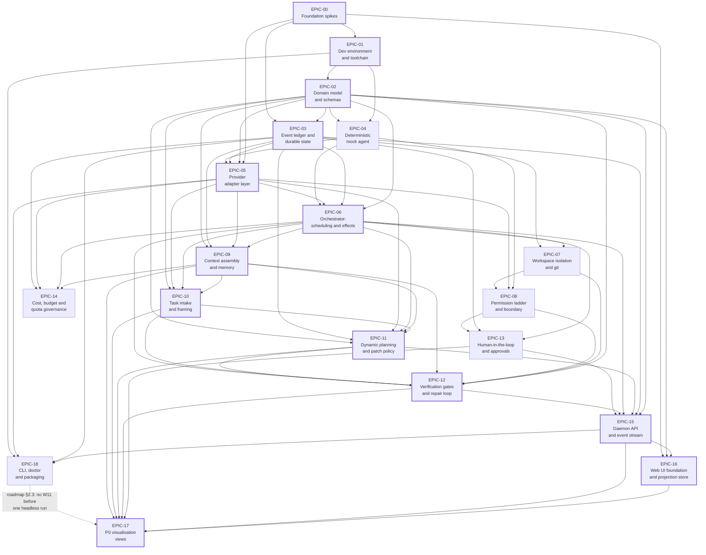

# DeFlow delivery board

> The state of the backlog: every epic, every story, every scenario, and the audit that says whether
> the plan actually delivers the product the [PRD](../prd.md) describes.

**Status:** Draft v1.0 · **Last reviewed:** 2 August 2026 · **Reconciled from:** 19 epic files, 19 flow files

[Delivery plan](./README.md) · [Architecture index](../README.md) · [Roadmap](../17-roadmap.md)

---

## 1. At a glance

|                                 |                                                                                              |
| ------------------------------- | -------------------------------------------------------------------------------------------- |
| **Epics**                       | 19 (EPIC-00 … EPIC-18)                                                                       |
| **Stories**                     | 137                                                                                          |
| **Scenarios**                   | 635                                                                                          |
| **Estimated size**              | **~310 working days** (sum of the epics' own declared totals)                                |
| **Longest dependency chain**    | **~228 days** — EPIC-00 → 01 → 02 → 03 → 05 → 06 → 09 → 10 → 11 → 12 → 15 → 16 → 17          |
| **P0 requirements in M1 scope** | 55 functional + NF1–NF10 + AR-1 — F3.3 moved to M2 on 2026-08-06                             |
| **Uncovered P0 requirements**   | **0** — F3.3 was the one gap and is now out of the M1 line (see [§7.1](#71-the-one-uncovered-requirement)) |
| **Traceability breaks**         | **0** — the three the first reconciliation found are fixed (see [§6](#6-traceability-check)) |

**Status counts**

| Level   | `Not started` | `Ready` | `In progress` | `Blocked` | `In review` | `Done` |
| ------- | ------------- | ------- | ------------- | --------- | ----------- | ------ |
| Epics   | 19            | 0       | 0             | 0         | 0           | 0      |
| Stories | 121           | 15      | 0             | 1         | 0           | 0      |

**Size distribution** — `XS` 2 · `S` 39 · `M` 76 · `L` 20 · `XL` **0** (no story is sized `XL`, which is the rule holding).

**Priority distribution** — `P0` 130 · `P1` 7 · `P2` 0. The seven `P1` stories are KAR-08.8, KAR-09.10, KAR-11.6, KAR-12.6, KAR-15.8, KAR-17.9, KAR-18.7 — they sit inside M1 epics but are not part of M1's definition of done.

Nothing has started. Fifteen stories are `Ready` — their Definition of Ready is already satisfied by the architecture documents — and one, KAR-17.9, is `Blocked` pending the KAR-16.6 performance measurement.

---

## 2. The epic board

**Ordering:** by _earliest possible start_ under longest-path (critical-path) scheduling over the dependencies the epic files declare, ties broken toward the critical-path member and then by id. This differs from id order in four places: **EPIC-09 precedes EPIC-07**, **EPIC-10 and EPIC-14 precede EPIC-13 and EPIC-11**, **EPIC-13 precedes EPIC-11**, and **EPIC-18 precedes EPIC-17**. Rows on the critical path are marked **▸**.

|       | Epic                                              | Title                                        | Status      | Pri | MS  | W                       | Stories | Scen | Size  | Depends on                                                    | Goal                                                                                                                                                                             |
| ----- | ------------------------------------------------- | -------------------------------------------- | ----------- | --- | --- | ----------------------- | ------- | ---- | ----- | ------------------------------------------------------------- | -------------------------------------------------------------------------------------------------------------------------------------------------------------------------------- |
| **▸** | [EPIC-00](./epics/EPIC-00-foundation-spikes.md)   | Foundation spikes                            | Not started | P0  | M0  | M0                      | 7       | 23   | ~7.5d | —                                                             | Every load-bearing unverified assumption is executed and recorded, or replaced by its documented fallback, before a line of product code exists.                                 |
| **▸** | [EPIC-01](./epics/EPIC-01-dev-environment.md)     | Development environment and toolchain        | Not started | P0  | M1  | pre-W0                  | 6       | 24   | ~11d  | EPIC-00                                                       | A fresh clone reaches a running daemon serving its UI in four commands, on macOS and Linux, with no build step and no credentials.                                               |
| **▸** | [EPIC-02](./epics/EPIC-02-domain-model.md)        | Domain model and schemas                     | Not started | P0  | M1  | W0                      | 10      | 28   | ~12d  | EPIC-01                                                       | `@DeFlow/core` exports every shared type as Zod 4 schemas, with TS types derived and JSON Schema emitted to `.DeFlow/schemas/`.                                                  |
| **▸** | [EPIC-03](./epics/EPIC-03-event-ledger.md)        | Event ledger and durable state               | Not started | P0  | M1  | W1                      | 9       | 30   | ~16d  | EPIC-02, EPIC-00                                              | An append-only SQLite ledger that can be `SIGKILL`ed mid-write and reopened without losing a committed event or reusing a sequence number.                                       |
|       | [EPIC-04](./epics/EPIC-04-mock-agent.md)          | Deterministic mock agent                     | Not started | P0  | M1  | W2                      | 6       | 22   | ~11d  | EPIC-01, EPIC-02                                              | Two real executables on a temp `PATH` reproduce every agent behaviour — including the pathological ones — deterministically and for free.                                        |
| **▸** | [EPIC-05](./epics/EPIC-05-provider-adapters.md)   | Provider adapter layer                       | Not started | P0  | M1  | W3                      | 9       | 32   | ~28d  | EPIC-00, EPIC-02, EPIC-03, EPIC-04                            | Heterogeneous vendor binaries become one internal event vocabulary, without DeFlow ever holding a model credential.                                                              |
| **▸** | [EPIC-06](./epics/EPIC-06-orchestrator.md)        | Orchestrator: scheduling and durable effects | Not started | P0  | M1  | W4                      | 9       | 31   | ~22d  | EPIC-02, EPIC-03, EPIC-05, EPIC-04                            | A pure `decide()` plus a write-ahead effect journal make `kill -9` at any instant resumable without re-executing completed work.                                                 |
| **▸** | [EPIC-09](./epics/EPIC-09-context-memory.md)      | Context assembly and memory                  | Not started | P0  | M1  | W6                      | 10      | 54   | ~21d  | EPIC-06, EPIC-05, EPIC-03, EPIC-02                            | Every agent invocation receives an engine-built packet assembled from declared reads, with the pinned set never compacted and every byte traceable to an event.                  |
|       | [EPIC-07](./epics/EPIC-07-workspace-isolation.md) | Workspace isolation and git orchestration    | Not started | P0  | M1  | W5a                     | 8       | 32   | ~17d  | EPIC-06, EPIC-03                                              | N write-capable agents share one repository without seeing or corrupting each other's files, with `merge-tree` as continuous conflict ground truth.                              |
|       | [EPIC-08](./epics/EPIC-08-safety-model.md)        | Permission ladder and execution boundary     | Not started | P0  | M1  | W5b                     | 8       | 33   | ~15d  | EPIC-04, EPIC-05, EPIC-07                                     | One pure policy function in DeFlow's own code decides every file write and every command, behind an execution boundary that removes authority by default.                        |
| **▸** | [EPIC-10](./epics/EPIC-10-task-intake.md)         | Task intake and framing                      | Not started | P0  | M1  | W7a                     | 5       | 29   | ~13d  | EPIC-09, EPIC-06, EPIC-05, EPIC-02                            | A task enters four ways and leaves as a `TaskSpec` the operator has actually read, edited and explicitly approved, minting a `specHash` everything downstream is judged against. |
|       | [EPIC-14](./epics/EPIC-14-cost-governance.md)     | Cost, budget and quota governance            | Not started | P0  | M1  | cross-cutting (W4 + W6) | 4       | 27   | ~11d  | EPIC-09, EPIC-06, EPIC-05, EPIC-03                            | A run knows live what it has spent per node, provider and run, says how each figure was obtained, and pauses rather than fails at a ceiling.                                     |
|       | [EPIC-13](./epics/EPIC-13-human-in-the-loop.md)   | Human-in-the-loop and approvals              | Not started | P0  | M1  | W8b                     | 4       | 28   | ~11d  | EPIC-06, EPIC-03, EPIC-08                                     | The operator is a participant, not an observer: a `human` node blocks a branch for six hours at the cost of one SQLite row and survives restart and sleep.                       |
| **▸** | [EPIC-11](./epics/EPIC-11-dynamic-planning.md)    | Dynamic planning and patch policy            | Not started | P0  | M1  | W7b                     | 6       | 31   | ~16d  | EPIC-10, EPIC-09, EPIC-06, EPIC-05, EPIC-03, EPIC-02          | The plan is a versioned JSON graph compiled from spec, recon and probed capabilities, validated before spend and mutated only through policy-checked patches.                    |
| **▸** | [EPIC-12](./epics/EPIC-12-verification-gates.md)  | Verification gates and the repair loop       | Not started | P0  | M1  | W8a                     | 6       | 39   | ~15d  | EPIC-02, EPIC-07, EPIC-08, EPIC-09, EPIC-10, EPIC-11, EPIC-06 | "Has the requested outcome been achieved?" is answered mechanically — deterministic gates first, adversarial review second, typed verdicts, capped surgical repair.              |
| **▸** | [EPIC-15](./epics/EPIC-15-daemon-api.md)          | Daemon API and event stream                  | Not started | P0  | M1  | W9                      | 8       | 48   | ~19d  | EPIC-02, EPIC-03, EPIC-11, EPIC-06, EPIC-12, EPIC-13          | Exactly one HTTP API and one multiplexed, resumable SSE stream, consumed by both the browser and the CLI through the same typed module.                                          |
| **▸** | [EPIC-16](./epics/EPIC-16-ui-foundation.md)       | Web UI foundation and projection store       | Not started | P0  | M1  | W10                     | 6       | 40   | ~20d  | EPIC-15, EPIC-02, EPIC-00                                     | A Vue application that is a second reducer over the same ledger, with pure projections, bounded memory and a replay harness.                                                     |
|       | [EPIC-18](./epics/EPIC-18-cli-packaging.md)       | CLI, doctor and packaging                    | Not started | P0  | M1  | W12                     | 7       | 49   | ~16d  | EPIC-15, EPIC-03, EPIC-05, EPIC-01                            | DeFlow becomes something a person installs and runs rather than clones: `init`, `up`, `run`, `doctor`, and a tarball that works in a clean environment.                          |
| **▸** | [EPIC-17](./epics/EPIC-17-p0-views.md)            | P0 visualisation views                       | Not started | P0  | M1  | W11                     | 9       | 35   | ~28d  | EPIC-16, EPIC-15, EPIC-13, EPIC-12, EPIC-11, EPIC-10, EPIC-09 | "Why did this run do that?" becomes a screen rather than a transcript, and the median time to that answer is measured, not asserted.                                             |

**Totals:** 19 epics · 137 stories · 635 scenarios · ~310 days.

Two workstream labels are not W-numbers: EPIC-00 is the M0 spike set and EPIC-01 is pre-W0 toolchain work, neither of which the roadmap's W0–W12 table covers. EPIC-14 is explicitly cross-cutting — its accounting half belongs to W6 and its ceiling half to W4.

---

## 3. The critical path

Derived from the `Depends on` field of each epic file, not from the skeleton and not from the roadmap. Hard edges are solid; the one soft edge the epic files declare in prose is dashed.

**The chain that sets the schedule:** EPIC-00 → 01 → 02 → 03 → 05 → 06 → 09 → 10 → 11 → 12 → 15 → 16 → 17, ≈ **228 days** of the ≈ 310 total. Everything else is slack against it.

### Where the declared dependencies contradict the roadmap

Four divergences from the W0–W12 graph in [roadmap §2.1 and §2.2](../17-roadmap.md). None is silently reconciled below; each is recorded as written.

| #   | What the epic files declare                                                 | What the roadmap declares                                                                                                                                                                           | Verdict                                                                                                                                                                                                                                                                                                                                                  |
| --- | --------------------------------------------------------------------------- | --------------------------------------------------------------------------------------------------------------------------------------------------------------------------------------------------- | -------------------------------------------------------------------------------------------------------------------------------------------------------------------------------------------------------------------------------------------------------------------------------------------------------------------------------------------------------- |
| 1   | **EPIC-05 (W3) depends on EPIC-03 (W1).**                                   | W3's dependencies are _W2, S1_. There is no W1 → W3 edge; W1 and W3 are on separate branches converging at W4.                                                                                      | **Stricter than the roadmap.** The epic needs the ledger for `provider_capabilities` persistence and blob spilling. It removes the option of working W3 while W1 is unfinished, which the roadmap's shape implies is available. Harmless to the critical path (W1 already precedes W4) but it does lengthen the earliest start of W3 by the whole of W1. |
| 2   | **EPIC-12 (W8a) depends on EPIC-11 (W7b).**                                 | W8 depends on _W5, W6_. W7 and W8 are parallel branches that both feed W9.                                                                                                                          | **A genuine contradiction.** The epic file's reason — plan validation is where acceptance-criteria coverage is enforced — is sound, but it serialises two branches the roadmap deliberately kept parallel, and it moves EPIC-12's earliest start from ~day 118 to ~day 147. This is the single largest schedule effect of any divergence here.           |
| 3   | **EPIC-08 (W5b) does not depend on EPIC-06 (W4).**                          | W5 depends on W4.                                                                                                                                                                                   | **Looser than the roadmap**, but only nominally: EPIC-08 depends on EPIC-07, which depends on EPIC-06, so the ordering survives transitively. Worth noting because it means the permission ladder could in principle be built against EPIC-05 alone if EPIC-07 slips.                                                                                    |
| 4   | **EPIC-18 (W12) gates EPIC-17 (W11)** — stated in EPIC-18's `Blocks` field. | The roadmap's mermaid graph has W9 → W12 and W10 → W11 with **no** W12 → W11 edge. Its §2.3 prose _does_ say "do not start W11 until at least one full run completes headlessly through W12's CLI". | **The epic files follow the roadmap's prose over its own diagram.** That is the right call, but the roadmap's diagram is now wrong and should be corrected rather than the backlog bent to match it.                                                                                                                                                     |

**No dependency cycles exist.** Every declared epic dependency points to a lower-numbered epic, and the one back-edge in the system (EPIC-18 → EPIC-17) is a soft scheduling constraint, not a build dependency.

---

## 4. The full story index

All 137 stories, in epic order. `Verified by` is the story's own declaration; §6 checks it against the flow files. Stories marked _(added)_ were not in the authoritative skeleton and were added under the [change rules](./README.md#9-changing-the-plan).

| Story                                              | Title                                                                           | Epic    | Status      | Pri | Size | PRD refs                                                                                      | Verified by                                                                                                                                                            |
| -------------------------------------------------- | ------------------------------------------------------------------------------- | ------- | ----------- | --- | ---- | --------------------------------------------------------------------------------------------- | ---------------------------------------------------------------------------------------------------------------------------------------------------------------------- |
| [KAR-00.1](./epics/EPIC-00-foundation-spikes.md)   | Spike: ACP client completes a full prompt cycle against a real adapter          | EPIC-00 | Not started | P0  | L    | F3.1, F3.4, F3.5, F6.9, F9.1, F10.5, AR-1                                                     | EPIC-00-S4, EPIC-00-S5, EPIC-00-S6, EPIC-00-S7, EPIC-00-S8, EPIC-00-S9, EPIC-00-S10                                                                                    |
| [KAR-00.2](./epics/EPIC-00-foundation-spikes.md)   | Spike: zero-build dev loop through pnpm workspace symlinks                      | EPIC-00 | Ready       | P0  | S    | NF5, NF6                                                                                      | EPIC-00-S1, EPIC-00-S2, EPIC-00-S3                                                                                                                                     |
| [KAR-00.3](./epics/EPIC-00-foundation-spikes.md)   | Spike: Vite middleware mode carrying SSE and HMR on one port                    | EPIC-00 | Not started | P0  | S    | NF3, NF10, F10.1, F10.6, F4.4                                                                 | EPIC-00-S11, EPIC-00-S12, EPIC-00-S13                                                                                                                                  |
| [KAR-00.4](./epics/EPIC-00-foundation-spikes.md)   | Spike: elkjs in a Vite 8 web worker                                             | EPIC-00 | Not started | P0  | S    | F10.1, F10.2                                                                                  | EPIC-00-S14, EPIC-00-S15, EPIC-00-S16                                                                                                                                  |
| [KAR-00.5](./epics/EPIC-00-foundation-spikes.md)   | Spike: native prebuilds load on the target machines                             | EPIC-00 | Not started | P0  | S    | NF4, NF5, NF6, F4.1, F4.2                                                                     | EPIC-00-S17, EPIC-00-S18, EPIC-00-S19                                                                                                                                  |
| [KAR-00.6](./epics/EPIC-00-foundation-spikes.md)   | Spike: Biome's Vue formatter on real SFCs                                       | EPIC-00 | Not started | P0  | XS   | NF6 (toolchain floor)                                                                         | EPIC-00-S20                                                                                                                                                            |
| [KAR-00.7](./epics/EPIC-00-foundation-spikes.md)   | Record spike outcomes and take the go/no-go decision against the kill criterion | EPIC-00 | Not started | P0  | XS   | F3.1, F3.2, AR-1                                                                              | EPIC-00-S10, EPIC-00-S21, EPIC-00-S22, EPIC-00-S23                                                                                                                     |
| [KAR-01.1](./epics/EPIC-01-dev-environment.md)     | pnpm workspace scaffold with catalog-pinned versions                            | EPIC-01 | Not started | P0  | M    | NF5, NF6                                                                                      | EPIC-01-S1, EPIC-01-S2, EPIC-01-S3, EPIC-01-S4, EPIC-01-S5, EPIC-01-S8                                                                                                 |
| [KAR-01.2](./epics/EPIC-01-dev-environment.md)     | TypeScript configuration and the erasable-syntax constraint                     | EPIC-01 | Not started | P0  | S    | NF6, NF9                                                                                      | EPIC-01-S6, EPIC-01-S7, EPIC-01-S8                                                                                                                                     |
| [KAR-01.3](./epics/EPIC-01-dev-environment.md)     | One-command dev loop: `pnpm dev` serves daemon and UI on one port               | EPIC-01 | Not started | P0  | M    | NF3, NF10, F4.2, F10.1, F10.6                                                                 | EPIC-01-S1, EPIC-01-S9, EPIC-01-S10, EPIC-01-S11, EPIC-01-S12, EPIC-01-S13                                                                                             |
| [KAR-01.4](./epics/EPIC-01-dev-environment.md)     | Test runner with four project slices and shared fixtures                        | EPIC-01 | Not started | P0  | M    | NF9, F4.2                                                                                     | EPIC-01-S14, EPIC-01-S15, EPIC-01-S16, EPIC-01-S17, EPIC-01-S18, EPIC-01-S19                                                                                           |
| [KAR-01.5](./epics/EPIC-01-dev-environment.md)     | Lint and format pipeline                                                        | EPIC-01 | Not started | P0  | S    | NF9, F4.2                                                                                     | EPIC-01-S20, EPIC-01-S21, EPIC-01-S22                                                                                                                                  |
| [KAR-01.6](./epics/EPIC-01-dev-environment.md)     | Git hooks and CI on macOS and Linux                                             | EPIC-01 | Not started | P0  | M    | NF4, NF5                                                                                      | EPIC-01-S20, EPIC-01-S21, EPIC-01-S23, EPIC-01-S24                                                                                                                     |
| [KAR-02.1](./epics/EPIC-02-domain-model.md)        | Identifier types and the stable-nodeId invariant                                | EPIC-02 | Ready       | P0  | S    | F4.3, F2.6, NF10                                                                              | EPIC-02-S1, EPIC-02-S2, EPIC-02-S3, EPIC-02-S4, EPIC-02-S5                                                                                                             |
| [KAR-02.2](./epics/EPIC-02-domain-model.md)        | TaskSpec schema with acceptance criteria and failure modes                      | EPIC-02 | Not started | P0  | S    | F1.2, F1.3, F1.5, F7.4                                                                        | EPIC-02-S6, EPIC-02-S7                                                                                                                                                 |
| [KAR-02.3](./epics/EPIC-02-domain-model.md)        | PlanGraph and the seven node types                                              | EPIC-02 | Not started | P0  | M    | F2.1, F2.3, F5.3, F5.4, F6.2, F6.4                                                            | EPIC-02-S4, EPIC-02-S9, EPIC-02-S10, EPIC-02-S11                                                                                                                       |
| [KAR-02.4](./epics/EPIC-02-domain-model.md)        | PlanPatch and its policy-relevant fields                                        | EPIC-02 | Not started | P0  | S    | F2.4, F2.5, F3.9                                                                              | EPIC-02-S2, EPIC-02-S3, EPIC-02-S12, EPIC-02-S13                                                                                                                       |
| [KAR-02.5](./epics/EPIC-02-domain-model.md)        | Fact, provenance and the blackboard vocabulary                                  | EPIC-02 | Not started | P0  | S    | F6.3, F6.7, F10.4                                                                             | EPIC-02-S14, EPIC-02-S15, EPIC-02-S16                                                                                                                                  |
| [KAR-02.6](./epics/EPIC-02-domain-model.md)        | ContextPacket and typed segments                                                | EPIC-02 | Not started | P0  | S    | F6.1, F6.2, F6.6, F10.3, F10.5                                                                | EPIC-02-S17, EPIC-02-S18                                                                                                                                               |
| [KAR-02.7](./epics/EPIC-02-domain-model.md)        | The Event union, envelope versioning and upcasters                              | EPIC-02 | Not started | P0  | M    | F4.1, F4.4, F6.6, F9.1, NF9, NF10                                                             | EPIC-02-S19, EPIC-02-S20, EPIC-02-S21, EPIC-02-S22, EPIC-02-S23                                                                                                        |
| [KAR-02.8](./epics/EPIC-02-domain-model.md)        | JSON Schema emission to `.DeFlow/schemas/`                                      | EPIC-02 | Not started | P0  | M    | F6.9, NF8, F3.5                                                                               | EPIC-02-S14, EPIC-02-S15, EPIC-02-S24, EPIC-02-S25, EPIC-02-S26                                                                                                        |
| [KAR-02.9](./epics/EPIC-02-domain-model.md)        | Canonical JSON encoding and content hashes _(added)_                            | EPIC-02 | Ready       | P0  | S    | F2.1, F2.6, NF9, NF10                                                                         | EPIC-02-S6, EPIC-02-S8                                                                                                                                                 |
| [KAR-02.10](./epics/EPIC-02-domain-model.md)       | NodeResult, NodeFailure and the closed failure taxonomy _(added)_               | EPIC-02 | Not started | P0  | S    | F4.5, F7.3, F9.1, NF10                                                                        | EPIC-02-S18, EPIC-02-S27, EPIC-02-S28                                                                                                                                  |
| [KAR-03.1](./epics/EPIC-03-event-ledger.md)        | The `Db` port and driver adapter                                                | EPIC-03 | Not started | P0  | S    | NF6, NF9                                                                                      | EPIC-03-S1, EPIC-03-S2, EPIC-03-S3, EPIC-03-S4, EPIC-03-S25                                                                                                            |
| [KAR-03.2](./epics/EPIC-03-event-ledger.md)        | Schema migrations on `PRAGMA user_version` with pre-migration backup            | EPIC-03 | Not started | P0  | S    | NF6, NF8                                                                                      | EPIC-03-S1, EPIC-03-S5, EPIC-03-S6, EPIC-03-S7                                                                                                                         |
| [KAR-03.3](./epics/EPIC-03-event-ledger.md)        | Append-only event table with monotonic sequence                                 | EPIC-03 | Not started | P0  | M    | F4.1, NF10                                                                                    | EPIC-03-S1, EPIC-03-S8, EPIC-03-S9, EPIC-03-S10                                                                                                                        |
| [KAR-03.4](./epics/EPIC-03-event-ledger.md)        | Control-plane / data-plane split and the `io_chunk` stream                      | EPIC-03 | Not started | P0  | M    | F4.1, F4.7, F10.6, NF3                                                                        | EPIC-03-S11, EPIC-03-S12, EPIC-03-S13, EPIC-03-S14, EPIC-03-S30                                                                                                        |
| [KAR-03.5](./epics/EPIC-03-event-ledger.md)        | The pure reducer and state projection                                           | EPIC-03 | Not started | P0  | M    | F4.1, NF9, NF10                                                                               | EPIC-03-S7, EPIC-03-S11, EPIC-03-S15, EPIC-03-S16, EPIC-03-S17                                                                                                         |
| [KAR-03.6](./epics/EPIC-03-event-ledger.md)        | Checkpoint cache with version-guarded invalidation                              | EPIC-03 | Not started | P0  | S    | F4.2, NF3                                                                                     | EPIC-03-S18, EPIC-03-S19, EPIC-03-S20, EPIC-03-S27                                                                                                                     |
| [KAR-03.7](./epics/EPIC-03-event-ledger.md)        | Single-instance lease and daemon epoch fencing                                  | EPIC-03 | Not started | P0  | M    | F4.1, NF4, NF6                                                                                | EPIC-03-S21, EPIC-03-S22, EPIC-03-S23                                                                                                                                  |
| [KAR-03.8](./epics/EPIC-03-event-ledger.md)        | Ledger replay on daemon start                                                   | EPIC-03 | Not started | P0  | M    | F4.2, NF4, NF9                                                                                | EPIC-03-S16, EPIC-03-S24, EPIC-03-S25, EPIC-03-S26, EPIC-03-S27                                                                                                        |
| [KAR-03.9](./epics/EPIC-03-event-ledger.md)        | Content-addressed blob spill for oversized payloads _(added)_                   | EPIC-03 | Not started | P0  | S    | F6.5, NF8, F4.1                                                                               | EPIC-03-S28, EPIC-03-S29                                                                                                                                               |
| [KAR-04.1](./epics/EPIC-04-mock-agent.md)          | Mock agent binary speaking ACP over a real subprocess                           | EPIC-04 | Ready       | P0  | M    | F3.7, NF9                                                                                     | EPIC-04-S1, EPIC-04-S2, EPIC-04-S3, EPIC-04-S21                                                                                                                        |
| [KAR-04.2](./epics/EPIC-04-mock-agent.md)          | Scripted scenario format                                                        | EPIC-04 | Not started | P0  | M    | F3.7, F3.4                                                                                    | EPIC-04-S4, EPIC-04-S5, EPIC-04-S6, EPIC-04-S7, EPIC-04-S22                                                                                                            |
| [KAR-04.3](./epics/EPIC-04-mock-agent.md)          | Pathological behaviours: hang, mid-turn crash, malformed frame, oversized line  | EPIC-04 | Not started | P0  | S    | F3.4, F3.7, F4.2, F4.4                                                                        | EPIC-04-S8, EPIC-04-S9, EPIC-04-S10, EPIC-04-S11, EPIC-04-S12                                                                                                          |
| [KAR-04.4](./epics/EPIC-04-mock-agent.md)          | Configurable capability advertisement                                           | EPIC-04 | Not started | P0  | S    | F3.5, F3.7                                                                                    | EPIC-04-S13, EPIC-04-S14                                                                                                                                               |
| [KAR-04.5](./epics/EPIC-04-mock-agent.md)          | Recording replay as a provider                                                  | EPIC-04 | Not started | P0  | M    | F3.4, F3.7, F4.9                                                                              | EPIC-04-S15, EPIC-04-S16                                                                                                                                               |
| [KAR-04.6](./epics/EPIC-04-mock-agent.md)          | Fake exec-shim agent for the CLI fallback path                                  | EPIC-04 | Not started | P0  | M    | F3.2, F3.4, F5.7                                                                              | EPIC-04-S17, EPIC-04-S18, EPIC-04-S19, EPIC-04-S20                                                                                                                     |
| [KAR-05.1](./epics/EPIC-05-provider-adapters.md)   | ACP client: initialize, session lifecycle, streaming updates                    | EPIC-05 | Not started | P0  | L    | F3.1, F4.1, NF9                                                                               | EPIC-05-S1, EPIC-05-S2, EPIC-05-S3, EPIC-05-S4, EPIC-05-S5                                                                                                             |
| [KAR-05.2](./epics/EPIC-05-provider-adapters.md)   | Runtime capability probing and the persisted manifest                           | EPIC-05 | Not started | P0  | M    | F3.5, F3.6                                                                                    | EPIC-05-S6, EPIC-05-S7, EPIC-05-S8, EPIC-05-S9, EPIC-05-S27                                                                                                            |
| [KAR-05.3](./epics/EPIC-05-provider-adapters.md)   | Provider registry and spawn strategies per vendor                               | EPIC-05 | Not started | P0  | M    | F3.1, F3.6, NF7                                                                               | EPIC-05-S10, EPIC-05-S11, EPIC-05-S12                                                                                                                                  |
| [KAR-05.4](./epics/EPIC-05-provider-adapters.md)   | Frame-size guard, backpressure and blob spilling                                | EPIC-05 | Not started | P0  | M    | F3.4, F4.2, NF3, NF6                                                                          | EPIC-05-S3, EPIC-05-S13, EPIC-05-S14, EPIC-05-S15, EPIC-05-S16, EPIC-05-S17, EPIC-05-S18                                                                               |
| [KAR-05.5](./epics/EPIC-05-provider-adapters.md)   | Resume strategies: native and replay                                            | EPIC-05 | Not started | P0  | M    | F3.5, F4.2, F4.5, NF4                                                                         | EPIC-05-S19, EPIC-05-S20, EPIC-05-S21                                                                                                                                  |
| [KAR-05.6](./epics/EPIC-05-provider-adapters.md)   | MCP host exposing workflow tools to agents                                      | EPIC-05 | Not started | P0  | L    | F3.1, F6.5, F2.4, NF6                                                                         | EPIC-05-S22, EPIC-05-S23, EPIC-05-S24                                                                                                                                  |
| [KAR-05.7](./epics/EPIC-05-provider-adapters.md)   | Adapter conformance suite and golden recordings                                 | EPIC-05 | Not started | P0  | L    | F3.4, F3.6                                                                                    | EPIC-05-S25, EPIC-05-S26, EPIC-05-S27, EPIC-05-S28                                                                                                                     |
| [KAR-05.8](./epics/EPIC-05-provider-adapters.md)   | CLI exec shim fallback adapter                                                  | EPIC-05 | Not started | P0  | L    | F3.2, F3.4                                                                                    | EPIC-05-S29                                                                                                                                                            |
| [KAR-05.9](./epics/EPIC-05-provider-adapters.md)   | Process lifecycle: detached spawn, cancellation, orphan reaping                 | EPIC-05 | Not started | P0  | M    | F4.4, F5.7, F4.2                                                                              | EPIC-05-S4, EPIC-05-S30, EPIC-05-S31, EPIC-05-S32                                                                                                                      |
| [KAR-06.1](./epics/EPIC-06-orchestrator.md)        | The `decide` function and ready-set derivation                                  | EPIC-06 | Ready       | P0  | M    | F4.2, NF9                                                                                     | EPIC-06-S1, EPIC-06-S2, EPIC-06-S3, EPIC-06-S4                                                                                                                         |
| [KAR-06.2](./epics/EPIC-06-orchestrator.md)        | Bounded concurrency with per-resource-class semaphores                          | EPIC-06 | Not started | P0  | M    | F5.2, F4.2                                                                                    | EPIC-06-S4, EPIC-06-S5, EPIC-06-S6, EPIC-06-S7                                                                                                                         |
| [KAR-06.3](./epics/EPIC-06-orchestrator.md)        | Write-ahead effect journal and idempotency keys                                 | EPIC-06 | Not started | P0  | M    | F4.3, F4.2                                                                                    | EPIC-06-S8, EPIC-06-S9, EPIC-06-S10, EPIC-06-S11, EPIC-06-S17                                                                                                          |
| [KAR-06.4](./epics/EPIC-06-orchestrator.md)        | Effect reconciliation per effect type                                           | EPIC-06 | Not started | P0  | L    | F4.3, F4.2                                                                                    | EPIC-06-S12, EPIC-06-S13, EPIC-06-S14, EPIC-06-S15, EPIC-06-S16                                                                                                        |
| [KAR-06.5](./epics/EPIC-06-orchestrator.md)        | Node retry with classified errors and jittered backoff                          | EPIC-06 | Not started | P0  | M    | F4.5, F4.6, F9.2                                                                              | EPIC-06-S17, EPIC-06-S18, EPIC-06-S19, EPIC-06-S20, EPIC-06-S31                                                                                                        |
| [KAR-06.6](./epics/EPIC-06-orchestrator.md)        | Durable wake times and long suspension                                          | EPIC-06 | Not started | P0  | S    | F4.8, NF4                                                                                     | EPIC-06-S20, EPIC-06-S21, EPIC-06-S22                                                                                                                                  |
| [KAR-06.7](./epics/EPIC-06-orchestrator.md)        | Pause, resume and cancel as events                                              | EPIC-06 | Not started | P0  | M    | F4.4, F5.7                                                                                    | EPIC-06-S23, EPIC-06-S24, EPIC-06-S25                                                                                                                                  |
| [KAR-06.8](./epics/EPIC-06-orchestrator.md)        | No-progress detection: stall detector and churn circuit breaker                 | EPIC-06 | Not started | P0  | M    | F4.7                                                                                          | EPIC-06-S26, EPIC-06-S27, EPIC-06-S28                                                                                                                                  |
| [KAR-06.9](./epics/EPIC-06-orchestrator.md)        | Crash recovery and resume from the last completed boundary                      | EPIC-06 | Not started | P0  | M    | F4.2, NF4                                                                                     | EPIC-06-S6, EPIC-06-S11, EPIC-06-S16, EPIC-06-S25, EPIC-06-S29, EPIC-06-S30                                                                                            |
| [KAR-07.1](./epics/EPIC-07-workspace-isolation.md) | Git wrapper with version enforcement and forbidden-argument assertions          | EPIC-07 | Ready       | P0  | S    | F5.5, NF6                                                                                     | EPIC-07-S1, EPIC-07-S2, EPIC-07-S3, EPIC-07-S4                                                                                                                         |
| [KAR-07.2](./epics/EPIC-07-workspace-isolation.md) | Worktree lifecycle: create, lock, list, remove                                  | EPIC-07 | Not started | P0  | M    | F5.1, F5.2                                                                                    | EPIC-07-S9, EPIC-07-S10, EPIC-07-S11, EPIC-07-S12, EPIC-07-S13, EPIC-07-S14, EPIC-07-S15, EPIC-07-S16                                                                  |
| [KAR-07.3](./epics/EPIC-07-workspace-isolation.md) | Flat branch naming and ref-name validation                                      | EPIC-07 | Ready       | P0  | S    | F5.1                                                                                          | EPIC-07-S5, EPIC-07-S6, EPIC-07-S7, EPIC-07-S8                                                                                                                         |
| [KAR-07.4](./epics/EPIC-07-workspace-isolation.md) | Dirty-worktree salvage on removal                                               | EPIC-07 | Not started | P0  | S    | F5.1, NF8                                                                                     | EPIC-07-S17, EPIC-07-S18                                                                                                                                               |
| [KAR-07.5](./epics/EPIC-07-workspace-isolation.md) | Worktree environment setup and dependency sharing                               | EPIC-07 | Not started | P0  | M    | F5.1, NF6                                                                                     | EPIC-07-S19, EPIC-07-S20, EPIC-07-S21, EPIC-07-S22                                                                                                                     |
| [KAR-07.6](./epics/EPIC-07-workspace-isolation.md) | Continuous conflict detection with merge-tree                                   | EPIC-07 | Not started | P0  | M    | F5.2, F5.3                                                                                    | EPIC-07-S23, EPIC-07-S24, EPIC-07-S25, EPIC-07-S30                                                                                                                     |
| [KAR-07.7](./epics/EPIC-07-workspace-isolation.md) | Integration branch and ordered merge strategy                                   | EPIC-07 | Not started | P0  | L    | F5.2, F5.5                                                                                    | EPIC-07-S26, EPIC-07-S27, EPIC-07-S28                                                                                                                                  |
| [KAR-07.8](./epics/EPIC-07-workspace-isolation.md) | Orphaned worktree reaping on daemon start                                       | EPIC-07 | Not started | P0  | M    | F4.2, F5.1, NF4                                                                               | EPIC-07-S29, EPIC-07-S31, EPIC-07-S32                                                                                                                                  |
| [KAR-08.1](./epics/EPIC-08-safety-model.md)        | The four-level permission ladder as a policy function                           | EPIC-08 | Ready       | P0  | M    | F5.4                                                                                          | EPIC-08-S1, EPIC-08-S2, EPIC-08-S3, EPIC-08-S4, EPIC-08-S5, EPIC-08-S6                                                                                                 |
| [KAR-08.2](./epics/EPIC-08-safety-model.md)        | Filesystem mediation at the ACP fs boundary                                     | EPIC-08 | Not started | P0  | M    | F5.3, F5.4                                                                                    | EPIC-08-S7, EPIC-08-S8, EPIC-08-S9, EPIC-08-S10, EPIC-08-S11                                                                                                           |
| [KAR-08.3](./epics/EPIC-08-safety-model.md)        | Command mediation and the default-deny allowlist                                | EPIC-08 | Not started | P0  | M    | F5.6                                                                                          | EPIC-08-S12, EPIC-08-S13, EPIC-08-S14, EPIC-08-S15                                                                                                                     |
| [KAR-08.4](./epics/EPIC-08-safety-model.md)        | Child environment scrubbing                                                     | EPIC-08 | Ready       | P0  | S    | F5.6, NF2, AR-1                                                                               | EPIC-08-S16, EPIC-08-S17, EPIC-08-S18, EPIC-08-S19, EPIC-08-S33                                                                                                        |
| [KAR-08.5](./epics/EPIC-08-safety-model.md)        | Vendor sandbox policy injection                                                 | EPIC-08 | Not started | P0  | M    | F5.4, F5.6                                                                                    | EPIC-08-S20, EPIC-08-S21, EPIC-08-S22, EPIC-08-S23, EPIC-08-S24, EPIC-08-S25                                                                                           |
| [KAR-08.6](./epics/EPIC-08-safety-model.md)        | The kill switch and process-tree termination                                    | EPIC-08 | Not started | P0  | M    | F5.7                                                                                          | EPIC-08-S26, EPIC-08-S27, EPIC-08-S28, EPIC-08-S29                                                                                                                     |
| [KAR-08.7](./epics/EPIC-08-safety-model.md)        | Path-scope declaration and violation reporting                                  | EPIC-08 | Not started | P0  | S    | F5.3                                                                                          | EPIC-08-S11, EPIC-08-S30                                                                                                                                               |
| [KAR-08.8](./epics/EPIC-08-safety-model.md)        | Auth-shadowing detection                                                        | EPIC-08 | Ready       | P1  | S    | F3.8, AR-1                                                                                    | EPIC-08-S31, EPIC-08-S32                                                                                                                                               |
| [KAR-09.1](./epics/EPIC-09-context-memory.md)      | Declared reads and writes enforced at plan time                                 | EPIC-09 | Ready       | P0  | S    | F6.1, F6.2                                                                                    | EPIC-09-S1, EPIC-09-S2, EPIC-09-S3, EPIC-09-S4, EPIC-09-S5                                                                                                             |
| [KAR-09.2](./epics/EPIC-09-context-memory.md)      | Packet assembly under a token budget                                            | EPIC-09 | Not started | P0  | L    | F6.1, F6.2, F6.5, F10.3, F10.5, NF8, NF9                                                      | EPIC-09-S6, EPIC-09-S7, EPIC-09-S8, EPIC-09-S9, EPIC-09-S10, EPIC-09-S11, EPIC-09-S12, EPIC-09-S13, EPIC-09-S28                                                        |
| [KAR-09.3](./epics/EPIC-09-context-memory.md)      | Constraint pinning and the integrity check                                      | EPIC-09 | Not started | P0  | M    | F6.6, F1.5, F5.3, F5.4                                                                        | EPIC-09-S8, EPIC-09-S14, EPIC-09-S15, EPIC-09-S16, EPIC-09-S17, EPIC-09-S18, EPIC-09-S19, EPIC-09-S20                                                                  |
| [KAR-09.4](./epics/EPIC-09-context-memory.md)      | Prohibition-to-requirement rewriting and interval re-injection                  | EPIC-09 | Not started | P0  | M    | F6.6, F1.5, F8.5                                                                              | EPIC-09-S20, EPIC-09-S21, EPIC-09-S22, EPIC-09-S23, EPIC-09-S24, EPIC-09-S25                                                                                           |
| [KAR-09.5](./epics/EPIC-09-context-memory.md)      | Artifact offloading and handle resolution                                       | EPIC-09 | Not started | P0  | M    | F6.5, NF8                                                                                     | EPIC-09-S26, EPIC-09-S27, EPIC-09-S28, EPIC-09-S29                                                                                                                     |
| [KAR-09.6](./epics/EPIC-09-context-memory.md)      | Compaction events with fidelity discrimination                                  | EPIC-09 | Not started | P0  | M    | F6.6, F10.5, NF10                                                                             | EPIC-09-S30, EPIC-09-S31, EPIC-09-S32, EPIC-09-S33, EPIC-09-S34, EPIC-09-S35                                                                                           |
| [KAR-09.7](./epics/EPIC-09-context-memory.md)      | Token accounting in three tiers with self-calibration                           | EPIC-09 | Not started | P0  | M    | F9.1, F9.3, F10.5, NF1, NF6                                                                   | EPIC-09-S36, EPIC-09-S37, EPIC-09-S38, EPIC-09-S39, EPIC-09-S40, EPIC-09-S41                                                                                           |
| [KAR-09.8](./epics/EPIC-09-context-memory.md)      | The blackboard as a ledger projection, with invalidation                        | EPIC-09 | Not started | P0  | M    | F6.3, F10.4, NF9, NF10                                                                        | EPIC-09-S42, EPIC-09-S43, EPIC-09-S44, EPIC-09-S45                                                                                                                     |
| [KAR-09.9](./epics/EPIC-09-context-memory.md)      | Handoff contract validation and the bounded repair loop                         | EPIC-09 | Not started | P0  | M    | F6.4 (P0), F6.9 (P1)                                                                          | EPIC-09-S46, EPIC-09-S47, EPIC-09-S48, EPIC-09-S49, EPIC-09-S50                                                                                                        |
| [KAR-09.10](./epics/EPIC-09-context-memory.md)     | FTS5 retrieval over run artifacts                                               | EPIC-09 | Not started | P1  | S    | F6.7                                                                                          | EPIC-09-S51, EPIC-09-S52, EPIC-09-S53, EPIC-09-S54                                                                                                                     |
| [KAR-10.1](./epics/EPIC-10-task-intake.md)         | Task intake from text, file, issue reference or spec                            | EPIC-10 | Ready       | P0  | S    | F1.1, NF8, NF10                                                                               | EPIC-10-S1, EPIC-10-S2, EPIC-10-S3, EPIC-10-S4, EPIC-10-S5                                                                                                             |
| [KAR-10.2](./epics/EPIC-10-task-intake.md)         | The framing interview producing a TaskSpec                                      | EPIC-10 | Not started | P0  | L    | F1.2, F5.4, F6.1, F6.4, F7.4                                                                  | EPIC-10-S6, EPIC-10-S7, EPIC-10-S8, EPIC-10-S9, EPIC-10-S10, EPIC-10-S11, EPIC-10-S12                                                                                  |
| [KAR-10.3](./epics/EPIC-10-task-intake.md)         | Human review and approval of the TaskSpec                                       | EPIC-10 | Not started | P0  | M    | F1.3, F8.1, NF4, NF10                                                                         | EPIC-10-S13, EPIC-10-S14, EPIC-10-S15, EPIC-10-S16, EPIC-10-S17, EPIC-10-S18, EPIC-10-S29                                                                              |
| [KAR-10.4](./epics/EPIC-10-task-intake.md)         | Spec pinning and anti-drift re-injection                                        | EPIC-10 | Not started | P0  | M    | F1.5, F6.6, F7.4, NF10                                                                        | EPIC-10-S19, EPIC-10-S20, EPIC-10-S21, EPIC-10-S22, EPIC-10-S23, EPIC-10-S29                                                                                           |
| [KAR-10.5](./epics/EPIC-10-task-intake.md)         | Repository reconnaissance as planner input                                      | EPIC-10 | Not started | P0  | M    | F1.2, F2.2, F6.2, F6.3, F5.4                                                                  | EPIC-10-S24, EPIC-10-S25, EPIC-10-S26, EPIC-10-S27, EPIC-10-S28                                                                                                        |
| [KAR-11.1](./epics/EPIC-11-dynamic-planning.md)    | Plan compilation from spec, recon and capabilities                              | EPIC-11 | Not started | P0  | L    | F2.1, F2.2, F2.3, F3.5, F6.1, NF8                                                             | EPIC-11-S1, EPIC-11-S2, EPIC-11-S3, EPIC-11-S4, EPIC-11-S5                                                                                                             |
| [KAR-11.2](./epics/EPIC-11-dynamic-planning.md)    | Plan validation before execution                                                | EPIC-11 | Not started | P0  | M    | F2.2, F3.5, F5.4, F6.2, F7.4, F9.3                                                            | EPIC-11-S6, EPIC-11-S7, EPIC-11-S8, EPIC-11-S9, EPIC-11-S10, EPIC-11-S11, EPIC-11-S12, EPIC-11-S18                                                                     |
| [KAR-11.3](./epics/EPIC-11-dynamic-planning.md)    | Runtime plan mutation via PlanPatch                                             | EPIC-11 | Not started | P0  | L    | F2.4, F2.6, NF9, NF10                                                                         | EPIC-11-S13, EPIC-11-S14, EPIC-11-S15, EPIC-11-S16, EPIC-11-S17, EPIC-11-S18                                                                                           |
| [KAR-11.4](./epics/EPIC-11-dynamic-planning.md)    | The patch policy engine                                                         | EPIC-11 | Not started | P0  | M    | F2.5, F4.7, F5.4, F5.6, F9.3, NF10                                                            | EPIC-11-S19, EPIC-11-S20, EPIC-11-S21, EPIC-11-S22, EPIC-11-S23, EPIC-11-S24, EPIC-11-S25                                                                              |
| [KAR-11.5](./epics/EPIC-11-dynamic-planning.md)    | Plan version retention and diffable history                                     | EPIC-11 | Not started | P0  | S    | F2.6, F10.2, NF8, NF10                                                                        | EPIC-11-S26, EPIC-11-S27, EPIC-11-S28                                                                                                                                  |
| [KAR-11.6](./epics/EPIC-11-dynamic-planning.md)    | Provider re-routing recorded as a patch                                         | EPIC-11 | Not started | P1  | M    | F3.9 (P1), F4.8, NF7                                                                          | EPIC-11-S29, EPIC-11-S30, EPIC-11-S31                                                                                                                                  |
| [KAR-12.1](./epics/EPIC-12-verification-gates.md)  | Deterministic gate runner                                                       | EPIC-12 | Not started | P0  | M    | F7.1, F5.3, NF8                                                                               | EPIC-12-S1, EPIC-12-S2, EPIC-12-S3, EPIC-12-S4, EPIC-12-S5, EPIC-12-S6, EPIC-12-S7, EPIC-12-S8, EPIC-12-S9, EPIC-12-S10                                                |
| [KAR-12.2](./epics/EPIC-12-verification-gates.md)  | Independent adversarial review gate                                             | EPIC-12 | Not started | P0  | M    | F7.2, F6.1, NF7                                                                               | EPIC-12-S11, EPIC-12-S12, EPIC-12-S13, EPIC-12-S14, EPIC-12-S15, EPIC-12-S16, EPIC-12-S17                                                                              |
| [KAR-12.3](./epics/EPIC-12-verification-gates.md)  | Typed verdicts with evidence                                                    | EPIC-12 | Not started | P0  | M    | F7.3, F6.9, F6.4, F7.7                                                                        | EPIC-12-S18, EPIC-12-S19, EPIC-12-S20, EPIC-12-S21, EPIC-12-S22, EPIC-12-S23                                                                                           |
| [KAR-12.4](./epics/EPIC-12-verification-gates.md)  | Acceptance-criteria traceability                                                | EPIC-12 | Not started | P0  | S    | F7.4, F1.5, F10.8                                                                             | EPIC-12-S24, EPIC-12-S25, EPIC-12-S26, EPIC-12-S27, EPIC-12-S28                                                                                                        |
| [KAR-12.5](./epics/EPIC-12-verification-gates.md)  | The surgical repair loop                                                        | EPIC-12 | Not started | P0  | L    | F7.5, F4.5, F4.7, F2.4, F2.5                                                                  | EPIC-12-S29, EPIC-12-S30, EPIC-12-S31, EPIC-12-S32, EPIC-12-S33, EPIC-12-S34, EPIC-12-S35                                                                              |
| [KAR-12.6](./epics/EPIC-12-verification-gates.md)  | Custom gate discovery from `.DeFlow/gates/`                                     | EPIC-12 | Not started | P1  | S    | F7.6                                                                                          | EPIC-12-S36, EPIC-12-S37, EPIC-12-S38, EPIC-12-S39                                                                                                                     |
| [KAR-13.1](./epics/EPIC-13-human-in-the-loop.md)   | Blocking human nodes with cheap suspension                                      | EPIC-13 | Not started | P0  | M    | F8.1, F4.8, F4.4, NF4                                                                         | EPIC-13-S1, EPIC-13-S2, EPIC-13-S3, EPIC-13-S4, EPIC-13-S5, EPIC-13-S6, EPIC-13-S7, EPIC-13-S8, EPIC-13-S9                                                             |
| [KAR-13.2](./epics/EPIC-13-human-in-the-loop.md)   | The cross-run approval queue                                                    | EPIC-13 | Not started | P0  | M    | F8.3, NF10                                                                                    | EPIC-13-S10, EPIC-13-S11, EPIC-13-S12, EPIC-13-S13, EPIC-13-S14, EPIC-13-S15, EPIC-13-S16                                                                              |
| [KAR-13.3](./epics/EPIC-13-human-in-the-loop.md)   | Interjection into a running node                                                | EPIC-13 | Not started | P0  | M    | F8.2, F8.5 (P1, honestly degraded), F4.4                                                      | EPIC-13-S17, EPIC-13-S18, EPIC-13-S19, EPIC-13-S20, EPIC-13-S21                                                                                                        |
| [KAR-13.4](./epics/EPIC-13-human-in-the-loop.md)   | Permission escalation requests reaching the operator                            | EPIC-13 | Not started | P0  | M    | F5.4, F5.6, F8.1, F8.3                                                                        | EPIC-13-S22, EPIC-13-S23, EPIC-13-S24, EPIC-13-S25, EPIC-13-S26, EPIC-13-S27, EPIC-13-S28                                                                              |
| [KAR-14.1](./epics/EPIC-14-cost-governance.md)     | Live per-node, per-provider, per-run accounting                                 | EPIC-14 | Not started | P0  | M    | F9.1, F10.9, NF10                                                                             | EPIC-14-S1, EPIC-14-S2, EPIC-14-S3, EPIC-14-S4, EPIC-14-S5, EPIC-14-S6, EPIC-14-S7                                                                                     |
| [KAR-14.2](./epics/EPIC-14-cost-governance.md)     | Budget ceilings that pause rather than fail                                     | EPIC-14 | Not started | P0  | M    | F4.6, F9.2, F4.4, NF4, NF10                                                                   | EPIC-14-S8, EPIC-14-S9, EPIC-14-S10, EPIC-14-S11, EPIC-14-S12, EPIC-14-S13, EPIC-14-S14                                                                                |
| [KAR-14.3](./epics/EPIC-14-cost-governance.md)     | Pre-flight cost estimation                                                      | EPIC-14 | Not started | P0  | M    | F9.3, F2.5, F1.3                                                                              | EPIC-14-S15, EPIC-14-S16, EPIC-14-S17, EPIC-14-S18, EPIC-14-S19, EPIC-14-S20                                                                                           |
| [KAR-14.4](./epics/EPIC-14-cost-governance.md)     | Rate-limit awareness and backoff scheduling                                     | EPIC-14 | Not started | P0  | M    | F3.9, F4.5, F4.8, F9.4 (reactive half), NF7                                                   | EPIC-14-S21, EPIC-14-S22, EPIC-14-S23, EPIC-14-S24, EPIC-14-S25, EPIC-14-S26, EPIC-14-S27                                                                              |
| [KAR-15.1](./epics/EPIC-15-daemon-api.md)          | HTTP server, routing and the typed client                                       | EPIC-15 | Ready       | P0  | M    | NF3, NF6, NF8                                                                                 | EPIC-15-S1, EPIC-15-S2, EPIC-15-S3, EPIC-15-S4, EPIC-15-S5, EPIC-15-S6                                                                                                 |
| [KAR-15.2](./epics/EPIC-15-daemon-api.md)          | Bearer-token auth and origin validation                                         | EPIC-15 | Ready       | P0  | M    | NF2, and the threat model in PRD §4.5 / §13                                                   | EPIC-15-S7, EPIC-15-S8, EPIC-15-S9, EPIC-15-S10, EPIC-15-S11, EPIC-15-S12, EPIC-15-S13, EPIC-15-S14                                                                    |
| [KAR-15.3](./epics/EPIC-15-daemon-api.md)          | The multiplexed SSE stream                                                      | EPIC-15 | Not started | P0  | L    | F4.1, NF3, NF10                                                                               | EPIC-15-S15, EPIC-15-S16, EPIC-15-S17, EPIC-15-S18, EPIC-15-S19, EPIC-15-S20, EPIC-15-S21, EPIC-15-S22, EPIC-15-S23, EPIC-15-S24, EPIC-15-S25                          |
| [KAR-15.4](./epics/EPIC-15-daemon-api.md)          | Stream resume by `Last-Event-ID` and explicit cursor                            | EPIC-15 | Not started | P0  | M    | F4.1, NF10, NF4                                                                               | EPIC-15-S26, EPIC-15-S27, EPIC-15-S28, EPIC-15-S29, EPIC-15-S30, EPIC-15-S31, EPIC-15-S32                                                                              |
| [KAR-15.5](./epics/EPIC-15-daemon-api.md)          | Run control endpoints                                                           | EPIC-15 | Not started | P0  | S    | F4.4, F5.7, F1.1, F1.3, F8.1, F8.2, F8.3, F2.5                                                | EPIC-15-S33, EPIC-15-S34, EPIC-15-S35, EPIC-15-S36, EPIC-15-S37, EPIC-15-S38                                                                                           |
| [KAR-15.6](./epics/EPIC-15-daemon-api.md)          | Read endpoints for inspection surfaces                                          | EPIC-15 | Not started | P0  | L    | F2.6, F10.2, F10.3, F10.4, F10.5, F10.6, F10.7, F6.3, F6.5, F7.3, F7.4, F7.7, F3.5, F3.6, NF8 | EPIC-15-S39, EPIC-15-S40, EPIC-15-S41, EPIC-15-S42, EPIC-15-S43, EPIC-15-S44                                                                                           |
| [KAR-15.7](./epics/EPIC-15-daemon-api.md)          | Server-side state snapshot at a sequence                                        | EPIC-15 | Not started | P0  | S    | F10.2, F10.10, NF3                                                                            | EPIC-15-S45, EPIC-15-S46, EPIC-15-S47                                                                                                                                  |
| [KAR-15.8](./epics/EPIC-15-daemon-api.md)          | Interactive PTY WebSocket _(added)_                                             | EPIC-15 | Not started | P1  | S    | F8.5, F10.6                                                                                   | EPIC-15-S48                                                                                                                                                            |
| [KAR-16.1](./epics/EPIC-16-ui-foundation.md)       | Vue application shell, routing and theming                                      | EPIC-16 | Ready       | P0  | M    | NF3, F10.1, and the a11y floor under all of F10.1–F10.9                                       | EPIC-16-S1, EPIC-16-S2, EPIC-16-S3, EPIC-16-S4, EPIC-16-S5                                                                                                             |
| [KAR-16.2](./epics/EPIC-16-ui-foundation.md)       | The SSE client and event dispatcher                                             | EPIC-16 | Not started | P0  | M    | F4.1, NF10, NF3                                                                               | EPIC-16-S1, EPIC-16-S6, EPIC-16-S7, EPIC-16-S8, EPIC-16-S9, EPIC-16-S10, EPIC-16-S11, EPIC-16-S12, EPIC-16-S13, EPIC-16-S14, EPIC-16-S24                               |
| [KAR-16.3](./epics/EPIC-16-ui-foundation.md)       | Pure projection modules per view                                                | EPIC-16 | Not started | P0  | L    | F4.1, NF10, NF9, and the data behind F10.1–F10.9                                              | EPIC-16-S9, EPIC-16-S10, EPIC-16-S11, EPIC-16-S15, EPIC-16-S16, EPIC-16-S17, EPIC-16-S18, EPIC-16-S19, EPIC-16-S20, EPIC-16-S21, EPIC-16-S22, EPIC-16-S23, EPIC-16-S24 |
| [KAR-16.4](./epics/EPIC-16-ui-foundation.md)       | The run store with bounded memory                                               | EPIC-16 | Not started | P0  | M    | NF3, NF4, NF10                                                                                | EPIC-16-S25, EPIC-16-S26, EPIC-16-S27, EPIC-16-S28, EPIC-16-S29, EPIC-16-S30                                                                                           |
| [KAR-16.5](./epics/EPIC-16-ui-foundation.md)       | The replay harness serving recorded runs                                        | EPIC-16 | Not started | P0  | M    | F10.10 (mechanism), F4.9, NF8, and the development loop under F10.1–F10.9                     | EPIC-16-S31, EPIC-16-S32, EPIC-16-S33, EPIC-16-S34                                                                                                                     |
| [KAR-16.6](./epics/EPIC-16-ui-foundation.md)       | Graph canvas facade and a measured performance baseline                         | EPIC-16 | Not started | P0  | M    | F10.1, NF3                                                                                    | EPIC-16-S35, EPIC-16-S36, EPIC-16-S37, EPIC-16-S38, EPIC-16-S39, EPIC-16-S40                                                                                           |
| [KAR-17.1](./epics/EPIC-17-p0-views.md)            | Live plan graph                                                                 | EPIC-17 | Not started | P0  | M    | F10.1, NF3                                                                                    | EPIC-17-S1, EPIC-17-S2, EPIC-17-S3, EPIC-17-S4, EPIC-17-S35                                                                                                            |
| [KAR-17.2](./epics/EPIC-17-p0-views.md)            | Plan evolution scrubber                                                         | EPIC-17 | Not started | P0  | L    | F10.2, F2.6, F2.4, F2.5                                                                       | EPIC-17-S5, EPIC-17-S6, EPIC-17-S7, EPIC-17-S8, EPIC-17-S9, EPIC-17-S10, EPIC-17-S11, EPIC-17-S35                                                                      |
| [KAR-17.3](./epics/EPIC-17-p0-views.md)            | Node inspector                                                                  | EPIC-17 | Not started | P0  | L    | F10.3, F6.1, F6.2, F6.3, NF10                                                                 | EPIC-17-S12, EPIC-17-S13, EPIC-17-S14, EPIC-17-S15, EPIC-17-S16, EPIC-17-S35                                                                                           |
| [KAR-17.4](./epics/EPIC-17-p0-views.md)            | Context budget visualisation                                                    | EPIC-17 | Not started | P0  | M    | F10.5, F6.6, F9.1                                                                             | EPIC-17-S17, EPIC-17-S18, EPIC-17-S19, EPIC-17-S32, EPIC-17-S35                                                                                                        |
| [KAR-17.5](./epics/EPIC-17-p0-views.md)            | Live agent output streams                                                       | EPIC-17 | Not started | P0  | M    | F10.6, NF8                                                                                    | EPIC-17-S20, EPIC-17-S21, EPIC-17-S22, EPIC-17-S23                                                                                                                     |
| [KAR-17.6](./epics/EPIC-17-p0-views.md)            | Diff and review surface with inline verdicts                                    | EPIC-17 | Not started | P0  | M    | F10.7, F7.7, F7.3, F7.5                                                                       | EPIC-17-S24, EPIC-17-S25, EPIC-17-S26, EPIC-17-S27, EPIC-17-S35                                                                                                        |
| [KAR-17.7](./epics/EPIC-17-p0-views.md)            | Acceptance criteria board                                                       | EPIC-17 | Not started | P0  | S    | F10.8, F7.4, F7.3                                                                             | EPIC-17-S28, EPIC-17-S29, EPIC-17-S35                                                                                                                                  |
| [KAR-17.8](./epics/EPIC-17-p0-views.md)            | Run timeline with cost overlay                                                  | EPIC-17 | Not started | P0  | M    | F10.9, F9.1                                                                                   | EPIC-17-S30, EPIC-17-S31, EPIC-17-S32, EPIC-17-S35                                                                                                                     |
| [KAR-17.9](./epics/EPIC-17-p0-views.md)            | Memory and data-flow graph _(scope-cut candidate)_                              | EPIC-17 | Blocked     | P1  | L    | F10.4, F6.3                                                                                   | EPIC-17-S33, EPIC-17-S34                                                                                                                                               |
| [KAR-18.1](./epics/EPIC-18-cli-packaging.md)       | `DeFlow init` workspace bootstrap                                               | EPIC-18 | Not started | P0  | S    | F1.1, NF6, NF8                                                                                | EPIC-18-S1, EPIC-18-S2, EPIC-18-S3, EPIC-18-S4, EPIC-18-S5, EPIC-18-S6                                                                                                 |
| [KAR-18.2](./epics/EPIC-18-cli-packaging.md)       | `DeFlow up` daemon lifecycle                                                    | EPIC-18 | Not started | P0  | L    | NF3, NF6, F4.4, AR-1                                                                          | EPIC-18-S7, EPIC-18-S8, EPIC-18-S9, EPIC-18-S10, EPIC-18-S11, EPIC-18-S12, EPIC-18-S13, EPIC-18-S14, EPIC-18-S15, EPIC-18-S16, EPIC-18-S17                             |
| [KAR-18.3](./epics/EPIC-18-cli-packaging.md)       | `DeFlow run` headless execution                                                 | EPIC-18 | Not started | P0  | M    | F1.1, F4.4, F5.7, NF6                                                                         | EPIC-18-S18, EPIC-18-S19, EPIC-18-S20, EPIC-18-S21, EPIC-18-S22, EPIC-18-S23, EPIC-18-S24, EPIC-18-S25                                                                 |
| [KAR-18.4](./epics/EPIC-18-cli-packaging.md)       | `DeFlow doctor` environment and capability probe                                | EPIC-18 | Not started | P0  | L    | F3.4, F3.5, F3.6, F3.8, F5.4, NF1, NF5, AR-1, AR-5                                            | EPIC-18-S15, EPIC-18-S26, EPIC-18-S27, EPIC-18-S28, EPIC-18-S29, EPIC-18-S30, EPIC-18-S31, EPIC-18-S32, EPIC-18-S33, EPIC-18-S34, EPIC-18-S35, EPIC-18-S36             |
| [KAR-18.5](./epics/EPIC-18-cli-packaging.md)       | Single-package build and asset bundling                                         | EPIC-18 | Not started | P0  | M    | NF6, NF5                                                                                      | EPIC-18-S37, EPIC-18-S38, EPIC-18-S39, EPIC-18-S40, EPIC-18-S41                                                                                                        |
| [KAR-18.6](./epics/EPIC-18-cli-packaging.md)       | Install verification in a clean environment                                     | EPIC-18 | Not started | P0  | S    | NF6, NF5, NF1                                                                                 | EPIC-18-S42, EPIC-18-S43, EPIC-18-S44, EPIC-18-S45, EPIC-18-S46                                                                                                        |
| [KAR-18.7](./epics/EPIC-18-cli-packaging.md)       | Diagnostics: `DeFlow status` and `DeFlow ledger snapshot` _(added)_             | EPIC-18 | Not started | P1  | S    | NF8, NF10                                                                                     | EPIC-18-S47, EPIC-18-S48, EPIC-18-S49                                                                                                                                  |

---

## 5. PRD requirement coverage matrix

**This is the section the board exists for.** The requirement list below was enumerated directly from [prd.md §7 and §8](../prd.md) — the M1 scope is PRD §11's own line, _F1.1–F1.3, F2.1–F2.6, F3.1–F3.7, F4.1–F4.7, F5.1–F5.7, F6.1–F6.6, F7.1–F7.5, F8.1–F8.3, F9.1–F9.3, F10.1–F10.9_ — and each row was resolved by scanning the `PRD` field of all 137 stories. The epic files' own self-reported requirement lists were **not** trusted as input.

### 5.1 M1 (P0) functional requirements

| Req      | Requirement                                                                                | Covered by                                                                                                                                                     | Status                                                                                                                                                                                                                                                                              |
| -------- | ------------------------------------------------------------------------------------------ | -------------------------------------------------------------------------------------------------------------------------------------------------------------- | ----------------------------------------------------------------------------------------------------------------------------------------------------------------------------------------------------------------------------------------------------------------------------------- |
| F1.1     | Accept a task as free text, file, git issue reference or spec document                     | KAR-10.1, KAR-15.5, KAR-18.1, KAR-18.3                                                                                                                         | Covered                                                                                                                                                                                                                                                                             |
| F1.2     | Framing interview producing a `TaskSpec` with acceptance criteria and failure modes        | KAR-02.2, KAR-10.2, KAR-10.5                                                                                                                                   | Covered                                                                                                                                                                                                                                                                             |
| F1.3     | `TaskSpec` presented for human edit and explicit approval before any execution             | KAR-02.2, KAR-10.3, KAR-14.3, KAR-15.5                                                                                                                         | Covered                                                                                                                                                                                                                                                                             |
| F2.1     | The plan is data, not code — a versioned, diffable JSON `PlanGraph`                        | KAR-02.3, KAR-02.9, KAR-11.1                                                                                                                                   | Covered                                                                                                                                                                                                                                                                             |
| F2.2     | Planner agent compiles spec + recon + capability list into `PlanGraph` v1                  | KAR-10.5, KAR-11.1, KAR-11.2                                                                                                                                   | Covered                                                                                                                                                                                                                                                                             |
| F2.3     | Seven node types: `agent`, `tool`, `gate`, `human`, `map`, `loop`, `subgraph`              | KAR-02.3, KAR-11.1                                                                                                                                             | Covered                                                                                                                                                                                                                                                                             |
| F2.4     | Runtime plan mutation — any node may emit a `PlanPatch`                                    | KAR-02.4, KAR-05.6, KAR-11.3, KAR-12.5, KAR-17.2                                                                                                               | Covered                                                                                                                                                                                                                                                                             |
| F2.5     | Patch policy engine: auto-apply / queue / reject on declarative rules                      | KAR-02.4, KAR-11.4, KAR-12.5, KAR-14.3, KAR-15.5, KAR-17.2                                                                                                     | Covered                                                                                                                                                                                                                                                                             |
| F2.6     | Every plan version retained and scrubbable                                                 | KAR-02.1, KAR-02.9, KAR-11.3, KAR-11.5, KAR-15.6, KAR-17.2                                                                                                     | Covered                                                                                                                                                                                                                                                                             |
| F3.1     | ACP-first — DeFlow is an ACP client                                                        | KAR-00.1, KAR-00.7, KAR-05.1, KAR-05.3, KAR-05.6                                                                                                               | Covered                                                                                                                                                                                                                                                                             |
| F3.2     | CLI shim fallback for non-ACP agents                                                       | KAR-00.7, KAR-04.6, KAR-05.8                                                                                                                                   | **At risk** — KAR-05.8 is EPIC-05's named scope-cut candidate; if it is deferred (the epic's own Risks row costs it at −4–5 days) F3.2 goes **knowingly unmet at M1** and only the _test_ shim KAR-04.6 remains.                                                                    |
| **F3.3** | **Direct API adapter** when the user supplies their own key                                | — (KAR-05.10, M2)                                                                                                                                              | **Moved to M2 on 2026-08-06** — PRD §11's M1 line amended to `F3.1, F3.2, F3.4–F3.7`. Not an M1 gap; see [§7.1](#71-the-one-uncovered-requirement).                                                                                                                                 |
| F3.4     | Adapter conformance suite — the fixed battery, run on `doctor`                             | KAR-00.1, KAR-04.2, KAR-04.3, KAR-04.5, KAR-04.6, KAR-05.4, KAR-05.7, KAR-05.8, KAR-18.4                                                                       | Covered                                                                                                                                                                                                                                                                             |
| F3.5     | Capability manifest per adapter; planner cannot schedule against an unsupported capability | KAR-00.1, KAR-02.8, KAR-04.4, KAR-05.2, KAR-05.5, KAR-11.1, KAR-11.2, KAR-15.6, KAR-18.4                                                                       | Covered                                                                                                                                                                                                                                                                             |
| F3.6     | Pin and record the exact CLI version per run; warn on drift                                | KAR-05.2, KAR-05.3, KAR-05.7, KAR-15.6, KAR-18.4                                                                                                               | Covered                                                                                                                                                                                                                                                                             |
| F3.7     | Mock provider — deterministic, free, for structural testing and CI                         | KAR-04.1, KAR-04.2, KAR-04.3, KAR-04.4, KAR-04.5                                                                                                               | Covered                                                                                                                                                                                                                                                                             |
| F4.1     | Event-sourced ledger; one source of truth, everything else a projection                    | KAR-00.5, KAR-02.7, KAR-03.3, KAR-03.4, KAR-03.5, KAR-03.7, KAR-03.9, KAR-05.1, KAR-15.3, KAR-15.4, KAR-16.2, KAR-16.3                                         | Covered                                                                                                                                                                                                                                                                             |
| F4.2     | Resume after crash from the last completed boundary; completed nodes never re-executed     | KAR-00.5, KAR-01.3, KAR-01.4, KAR-01.5, KAR-03.6, KAR-03.8, KAR-04.3, KAR-05.4, KAR-05.5, KAR-05.9, KAR-06.1, KAR-06.2, KAR-06.3, KAR-06.4, KAR-06.9, KAR-07.8 | Covered                                                                                                                                                                                                                                                                             |
| F4.3     | Idempotency keys from `(run_id, node_id, attempt)` on every side effect                    | KAR-02.1, KAR-06.3, KAR-06.4                                                                                                                                   | Covered                                                                                                                                                                                                                                                                             |
| F4.4     | Pause / resume / cancel at any point, from UI or CLI, without losing state                 | KAR-00.3, KAR-02.7, KAR-04.3, KAR-05.9, KAR-06.7, KAR-13.1, KAR-13.3, KAR-14.2, KAR-15.5, KAR-18.2, KAR-18.3                                                   | Covered                                                                                                                                                                                                                                                                             |
| F4.5     | Node-level retry policy: max attempts, backoff, optional different provider                | KAR-02.10, KAR-05.5, KAR-06.5, KAR-12.5, KAR-14.4                                                                                                              | Covered                                                                                                                                                                                                                                                                             |
| F4.6     | Budget ceilings per run and per node that **pause** rather than fail                       | KAR-06.5, KAR-14.2                                                                                                                                             | Covered                                                                                                                                                                                                                                                                             |
| F4.7     | No-progress detection — halt a loop on near-identical diffs or repeated failure signature  | KAR-03.4, KAR-06.8, KAR-11.4, KAR-12.5                                                                                                                         | Covered                                                                                                                                                                                                                                                                             |
| F5.1     | Git worktree per write-capable branch, with never-reused branch names                      | KAR-07.2, KAR-07.3, KAR-07.4, KAR-07.5, KAR-07.8                                                                                                               | Covered                                                                                                                                                                                                                                                                             |
| F5.2     | Serialise writes, parallelise reads                                                        | KAR-06.2, KAR-07.2, KAR-07.6, KAR-07.7                                                                                                                         | Covered                                                                                                                                                                                                                                                                             |
| F5.3     | Path-scope declarations, with violations surfaced as a gate failure                        | KAR-02.3, KAR-07.6, KAR-08.2, KAR-08.7, KAR-09.3, KAR-12.1                                                                                                     | Covered                                                                                                                                                                                                                                                                             |
| F5.4     | Graduated four-level permission ladder; refuse to schedule rather than escalate silently   | KAR-02.3, KAR-08.1, KAR-08.2, KAR-08.5, KAR-09.3, KAR-10.2, KAR-10.5, KAR-11.2, KAR-11.4, KAR-13.4, KAR-18.4                                                   | Covered                                                                                                                                                                                                                                                                             |
| F5.5     | Never write to the default branch                                                          | KAR-07.1, KAR-07.7                                                                                                                                             | Covered                                                                                                                                                                                                                                                                             |
| F5.6     | The execution boundary is guarded — no destructive action without a human gate             | KAR-08.3, KAR-08.4, KAR-08.5, KAR-11.4, KAR-13.4                                                                                                               | Covered                                                                                                                                                                                                                                                                             |
| F5.7     | Kill switch — one control stops every child process in a run                               | KAR-04.6, KAR-05.9, KAR-06.7, KAR-08.6, KAR-15.5, KAR-18.3                                                                                                     | Covered                                                                                                                                                                                                                                                                             |
| F6.1     | No implicit context inheritance                                                            | KAR-02.6, KAR-09.1, KAR-09.2, KAR-10.2, KAR-11.1, KAR-12.2, KAR-17.3                                                                                           | Covered                                                                                                                                                                                                                                                                             |
| F6.2     | Declared reads and writes; undeclared reads fail validation at plan time                   | KAR-02.3, KAR-02.6, KAR-09.1, KAR-09.2, KAR-10.5, KAR-11.2, KAR-17.3                                                                                           | Covered — KAR-02.3 (`readsAreSatisfiable`) and KAR-09.1 (`validateDeclaredReads`) are one gate: the KAR-02.3 name is a view over the KAR-09.1 walk, not a second implementation.                                                                                                    |
| F6.3     | Provenance on every fact, with invalidation flagging downstream consumers                  | KAR-02.5, KAR-09.8, KAR-10.5, KAR-15.6, KAR-17.3, KAR-17.9                                                                                                     | Covered                                                                                                                                                                                                                                                                             |
| F6.4     | Subagent isolation with a bounded (500–2,000 token) condensed return                       | KAR-02.3, KAR-09.9, KAR-10.2, KAR-12.3                                                                                                                         | Covered — KAR-09.9 is `P0` for the F6.4 return budget and `P1` for the F6.9 schema half.                                                                                                                                                                                            |
| F6.5     | Artifact offloading to disk with handle resolution                                         | KAR-03.9, KAR-05.6, KAR-09.2, KAR-09.5, KAR-15.6                                                                                                               | Covered                                                                                                                                                                                                                                                                             |
| F6.6     | Compaction with constraint pinning; every compaction is an event                           | KAR-02.6, KAR-02.7, KAR-09.3, KAR-09.4, KAR-09.6, KAR-10.4, KAR-17.4                                                                                           | Covered                                                                                                                                                                                                                                                                             |
| F7.1     | Deterministic gates first — typecheck, lint, tests, build, custom scripts                  | KAR-12.1                                                                                                                                                       | Covered                                                                                                                                                                                                                                                                             |
| F7.2     | Independent adversarial review on a different session and preferably a different provider  | KAR-12.2                                                                                                                                                       | Covered                                                                                                                                                                                                                                                                             |
| F7.3     | Typed verdicts with evidence: `pass` / `fail` / `needs-human` plus structured findings     | KAR-02.10, KAR-12.3, KAR-15.6, KAR-17.6, KAR-17.7                                                                                                              | Covered                                                                                                                                                                                                                                                                             |
| F7.4     | Acceptance-criteria traceability — every criterion maps to at least one gate               | KAR-02.2, KAR-10.2, KAR-10.4, KAR-11.2, KAR-12.4, KAR-15.6, KAR-17.7                                                                                           | Covered                                                                                                                                                                                                                                                                             |
| F7.5     | Surgical repair loop: one issue, regression test first, capped at 3, then escalate         | KAR-12.5, KAR-17.6                                                                                                                                             | Covered                                                                                                                                                                                                                                                                             |
| F8.1     | Blocking `human` nodes — approve, reject, edit, inject guidance                            | KAR-10.3, KAR-13.1, KAR-13.4, KAR-15.5                                                                                                                         | Covered                                                                                                                                                                                                                                                                             |
| F8.2     | Interject at any time into a running node without discarding the run                       | KAR-13.3, KAR-15.5                                                                                                                                             | Covered                                                                                                                                                                                                                                                                             |
| F8.3     | Approval queue — one surface across all runs                                               | KAR-13.2, KAR-13.4, KAR-15.5                                                                                                                                   | Covered                                                                                                                                                                                                                                                                             |
| F9.1     | Per-node, per-provider, per-run token and cost accounting, live                            | KAR-00.1, KAR-02.7, KAR-02.10, KAR-09.7, KAR-14.1, KAR-17.4, KAR-17.8                                                                                          | Covered                                                                                                                                                                                                                                                                             |
| F9.2     | Hard ceilings that pause rather than fail                                                  | KAR-06.5, KAR-14.2                                                                                                                                             | Covered                                                                                                                                                                                                                                                                             |
| F9.3     | Pre-flight estimate before a run, and before an expensive `PlanPatch`                      | KAR-09.7, KAR-11.2, KAR-11.4, KAR-14.3                                                                                                                         | Covered                                                                                                                                                                                                                                                                             |
| F10.1    | Live plan graph — interactive DAG with node states and labelled edges                      | KAR-00.3, KAR-00.4, KAR-01.3, KAR-16.1, KAR-16.3, KAR-16.5, KAR-16.6, KAR-17.1                                                                                 | Covered                                                                                                                                                                                                                                                                             |
| F10.2    | Plan evolution scrubber — the marquee feature                                              | KAR-00.4, KAR-11.5, KAR-15.6, KAR-15.7, KAR-17.2                                                                                                               | Covered                                                                                                                                                                                                                                                                             |
| F10.3    | Node inspector — packet, prompt, raw output, provider, permission, cost, worktree          | KAR-02.6, KAR-09.2, KAR-15.6, KAR-17.3                                                                                                                         | Covered                                                                                                                                                                                                                                                                             |
| F10.4    | Memory & data-flow view — facts as nodes, reads and writes as edges                        | KAR-02.5, KAR-09.8, KAR-15.6, KAR-17.9                                                                                                                         | **At risk** — KAR-17.9 is `Blocked` and `P1` against a **P0** requirement. EPIC-17 records this deliberately and nominates KAR-17.3's provenance table as F10.4's M1 substitute. The data layer (KAR-09.8, KAR-15.6) is P0 and unaffected; the _graph view_ is not delivered at P0. |
| F10.5    | Context budget visualisation with compaction events inline                                 | KAR-00.1, KAR-02.6, KAR-09.2, KAR-09.6, KAR-09.7, KAR-15.6, KAR-17.4                                                                                           | Covered                                                                                                                                                                                                                                                                             |
| F10.6    | Live agent streams, tailable per node                                                      | KAR-00.3, KAR-01.3, KAR-03.4, KAR-15.6, KAR-15.8, KAR-17.5                                                                                                     | Covered                                                                                                                                                                                                                                                                             |
| F10.7    | Diff & review surface with gate verdicts attached inline                                   | KAR-15.6, KAR-17.6                                                                                                                                             | Covered                                                                                                                                                                                                                                                                             |
| F10.8    | Acceptance criteria board with live status and gate evidence                               | KAR-12.4, KAR-17.7                                                                                                                                             | Covered                                                                                                                                                                                                                                                                             |
| F10.9    | Run timeline — Gantt of parallel agents with cost overlaid                                 | KAR-14.1, KAR-16.1, KAR-16.3, KAR-16.5, KAR-17.8                                                                                                               | Covered                                                                                                                                                                                                                                                                             |

**All 55 P0 functional requirements in the M1 line are covered.** F3.3 was the 56th and the only gap; it
moved to M2 on 2026-08-06 and PRD §11's M1 line was amended to match, so the backlog now delivers M1 as
the PRD defines it.

### 5.2 Non-functional requirements and AR-1

| Req  | Requirement                                                                    | Covered by                                                                                                                                                                                                                                                          | Status  |
| ---- | ------------------------------------------------------------------------------ | ------------------------------------------------------------------------------------------------------------------------------------------------------------------------------------------------------------------------------------------------------------------- | ------- |
| NF1  | Local-first — full functionality with no network beyond the provider CLIs' own | KAR-09.7, KAR-18.4, KAR-18.6                                                                                                                                                                                                                                        | Covered |
| NF2  | Zero credential handling (AR-1), verifiable by inspection                      | KAR-08.4, KAR-15.2                                                                                                                                                                                                                                                  | Covered |
| NF3  | Cold start < 3 s for the daemon; UI interactive < 1 s on localhost             | KAR-00.3, KAR-01.3, KAR-03.4, KAR-03.6, KAR-05.4, KAR-15.1, KAR-15.3, KAR-15.7, KAR-16.1, KAR-16.2, KAR-16.4, KAR-16.6, KAR-17.1, KAR-18.2                                                                                                                          | Covered |
| NF4  | Run state survives daemon restart, OS restart and laptop sleep                 | KAR-00.5, KAR-01.6, KAR-03.7, KAR-03.8, KAR-05.5, KAR-06.6, KAR-06.9, KAR-07.8, KAR-10.3, KAR-13.1, KAR-14.2, KAR-15.4, KAR-16.4                                                                                                                                    | Covered |
| NF5  | Cross-platform: macOS and Linux at M1                                          | KAR-00.2, KAR-00.5, KAR-01.1, KAR-01.6, KAR-18.4, KAR-18.5, KAR-18.6                                                                                                                                                                                                | Covered |
| NF6  | Single-binary-ish install — `npx DeFlow up`, no DB server, no Docker           | KAR-00.2, KAR-00.5, KAR-00.6, KAR-01.1, KAR-01.2, KAR-03.1, KAR-03.2, KAR-03.7, KAR-05.4, KAR-05.6, KAR-07.1, KAR-07.5, KAR-09.7, KAR-15.1, KAR-18.1, KAR-18.2, KAR-18.3, KAR-18.5, KAR-18.6                                                                        | Covered |
| NF7  | Graceful provider degradation                                                  | KAR-05.3, KAR-11.6, KAR-12.2, KAR-14.4                                                                                                                                                                                                                              | Covered |
| NF8  | Every artifact inspectable on disk in an open format                           | KAR-02.8, KAR-03.2, KAR-03.9, KAR-07.4, KAR-09.2, KAR-09.5, KAR-10.1, KAR-11.1, KAR-11.5, KAR-12.1, KAR-15.1, KAR-15.6, KAR-16.5, KAR-17.5, KAR-18.1, KAR-18.7                                                                                                      | Covered |
| NF9  | Deterministic core — no nondeterminism outside adapter boundaries              | KAR-01.2, KAR-01.4, KAR-01.5, KAR-02.7, KAR-02.9, KAR-03.1, KAR-03.5, KAR-03.8, KAR-04.1, KAR-05.1, KAR-06.1, KAR-09.2, KAR-09.8, KAR-11.3, KAR-16.3                                                                                                                | Covered |
| NF10 | Auditable — any state in the UI traceable to specific ledger events            | KAR-00.3, KAR-01.3, KAR-02.1, KAR-02.7, KAR-02.9, KAR-02.10, KAR-03.3, KAR-03.5, KAR-09.6, KAR-09.8, KAR-10.1, KAR-10.3, KAR-10.4, KAR-11.3, KAR-11.4, KAR-11.5, KAR-13.2, KAR-14.1, KAR-14.2, KAR-15.3, KAR-15.4, KAR-16.2, KAR-16.3, KAR-16.4, KAR-17.3, KAR-18.7 | Covered |
| AR-1 | DeFlow never possesses a model credential                                      | KAR-00.1, KAR-00.7, KAR-08.4, KAR-08.8, KAR-18.2, KAR-18.4                                                                                                                                                                                                          | Covered |

**All ten non-functional requirements and AR-1 are covered.** NF5 (cross-platform) and NF6 (single-binary-ish install) are the two carried by the widest set of stories, which is correct — they are properties of everything, not features of anything.

### 5.3 P1/P2 requirements that stories nonetheless cite

Not part of M1's definition of done; listed so a reader does not mistake incidental coverage for scope creep.

| Req    | PRD priority      | Cited by                                         |
| ------ | ----------------- | ------------------------------------------------ |
| AR-5   | architecture rule | KAR-18.4                                         |
| F1.5   | P1                | KAR-02.2, KAR-09.3, KAR-09.4, KAR-10.4, KAR-12.4 |
| F10.10 | P1                | KAR-15.7, KAR-16.5                               |
| F3.8   | P1                | KAR-08.8, KAR-18.4                               |
| F3.9   | P1                | KAR-02.4, KAR-11.6, KAR-14.4                     |
| F4.8   | P1                | KAR-06.6, KAR-11.6, KAR-13.1, KAR-14.4           |
| F4.9   | P1                | KAR-04.5, KAR-16.5                               |
| F6.7   | P1                | KAR-02.5, KAR-09.10                              |
| F6.9   | P1                | KAR-00.1, KAR-02.8, KAR-09.9, KAR-12.3           |
| F7.6   | P1                | KAR-12.6                                         |
| F7.7   | P1                | KAR-12.3, KAR-15.6, KAR-17.6                     |
| F8.5   | P1                | KAR-09.4, KAR-13.3, KAR-15.8                     |
| F9.4   | P1                | KAR-14.4                                         |

The notable one is **F1.5** (anti-drift spec re-injection). It is `P1` in the PRD but EPIC-10 pulls it into M1 deliberately, and KAR-09.3, KAR-09.4, KAR-10.4 and KAR-12.4 all depend on it. That is scope _added_ to M1, and it is recorded rather than silent — but it is ~4 days that PRD §11 does not ask for.

---

## 6. Traceability check

Mechanical, both directions, across all 19 epic files and all 19 flow files.

| Check                                                           | Result                                                               |
| --------------------------------------------------------------- | -------------------------------------------------------------------- |
| Every story cites ≥ 1 PRD requirement id                        | **137 / 137 pass**                                                   |
| Every story declares ≥ 1 `Verified by` scenario                 | **137 / 137 pass**                                                   |
| Every `Verified by` scenario id exists in that epic's flow file | **683 / 683 references resolve**                                     |
| Every scenario declares ≥ 1 `Verifies` story                    | **635 / 635 pass**                                                   |
| Every `Verifies` story id exists in that epic's file            | **683 / 683 references resolve across 635 scenarios**                |
| Every story is named by ≥ 1 scenario                            | **137 / 137 pass** — no orphan stories                               |
| Flow index table matches the scenario bodies in that file       | **19 / 19 files agree on scenario ids and on every `Verifies` cell** |
| Story `Verified by` ⇄ scenario `Verifies` reciprocity           | **0 breaks** — the three found on the first pass are fixed, below    |

### The three breaks, and what was done about them

| #   | Break                                                                                                                                                                                                          | Where                                                                                                          | Resolution                                                                                                                                                                                       |
| --- | -------------------------------------------------------------------------------------------------------------------------------------------------------------------------------------------------------------- | -------------------------------------------------------------------------------------------------------------- | ------------------------------------------------------------------------------------------------------------------------------------------------------------------------------------------------ |
| 1   | `EPIC-00-S10` declares **Verifies: KAR-00.1, KAR-00.7**, but KAR-00.7's `Verified by` was `EPIC-00-S21, EPIC-00-S22, EPIC-00-S23` — S10 was missing.                                                           | [EPIC-00 flows](./flows/EPIC-00-foundation-spikes-flows.md) vs [EPIC-00](./epics/EPIC-00-foundation-spikes.md) | **Fixed:** `EPIC-00-S10` added to KAR-00.7's `Verified by`. The scenario genuinely records a kill-criterion input, so the scenario was right and the story was stale.                            |
| 2   | `EPIC-18-S15` declares **Verifies: KAR-18.2, KAR-18.4**, but KAR-18.4's `Verified by` listed S26–S36 and omitted S15.                                                                                          | [EPIC-18 flows](./flows/EPIC-18-cli-packaging-flows.md) vs [EPIC-18](./epics/EPIC-18-cli-packaging.md)         | **Fixed:** `EPIC-18-S15` added to KAR-18.4's `Verified by`.                                                                                                                                      |
| 3   | `EPIC-17-S35`'s **flow index row** said it verifies _"all nine stories"_ in prose, while the scenario body enumerates seven: KAR-17.1, 17.2, 17.3, 17.4, 17.6, 17.7, 17.8. KAR-17.5 and KAR-17.9 are excluded. | [EPIC-17 flows](./flows/EPIC-17-p0-views-flows.md)                                                             | **Fixed:** the index cell now carries the seven explicit ids. The body was right — S35 is the five-minute-diagnosis measurement and the two excluded stories are the two reduced/deferred views. |

None of the three was a missing scenario or a missing story. All three were one-directional link rot in the _epic_ file — the cheap direction to fix.

---

## 7. Gaps, risks and recommendations

### 7.1 The one uncovered requirement

**F3.3 — direct API adapter — has no story anywhere in the backlog.** It is a **P0** in PRD §7.3 and
sits inside PRD §11's M1 line (`F3.1–F3.7`).

The gap is deliberate and recorded, not an oversight: [EPIC-05 §Out of scope](./epics/EPIC-05-provider-adapters.md)
scopes it to M2 on the grounds that no package selection was verified on 2026-08-02 and that holding a
user's key inverts the credential posture AR-1 exists to protect; [EPIC-04](./epics/EPIC-04-mock-agent.md)
repeats the note. That is the right process — a gap written into an epic's Risks rather than dropped
silently — but it does not make the gap smaller.

**What it meant:** as originally written, this backlog did not deliver M1 as PRD §11 defines M1.

**Step 1 — option 2 was drafted.** [KAR-05.10 — Direct API adapter on a user-supplied
key](./epics/EPIC-05-provider-adapters.md) was added: `M`, `P0`, one vendor, `read`-level only, behind an
explicit per-provider opt-in in `.DeFlow/config.yaml`, verified by EPIC-05-S33/S34/S35. It is shaped to
respect both of the architecture's objections rather than overrule them — the AR-1 concern is answered by
requiring explicit consent (a key present in the environment is _not_ consent) and by a mechanical
sentinel test proving the key never reaches disk, and the unverified-package concern is answered by
leaving the package choice to the story and recording it in the tech stack when made.

**Step 2 — RESOLVED 2026-08-06 (owner): option 1 was taken instead.** PRD §11's M1 line now reads
`F3.1, F3.2, F3.4–F3.7`, F3.3 is listed under M2, and KAR-05.10 is retained in the EPIC-05 file in full as
the **M2 specification** with a decision note at its head. It has no Linear issue by design — Linear
tracks M1. The reasoning is recorded in the PRD itself, not only here: no HTTP client package was ever
selected, and a direct API adapter inverts the AR-1 credential posture, which at M1 keeps DeFlow holding
no credential of any kind.

**The cost is accepted explicitly rather than absorbed silently.** The capability manifest and the
conformance battery were both designed against ACP, so until a non-subprocess adapter passes them
unmodified, **"provider-neutral adapter abstraction" remains an untested claim at M1** — the abstraction
may be provider-neutral or it may be merely ACP-shaped, and nothing in the M1 backlog distinguishes the
two. Downstream consequence: EPIC-09's KAR-09.7 tier-3 exact token counting is reachable only through this
adapter, so at M1 only its negative assertion (no `/v1/messages/count_tokens` request on the subscription
path) is exercisable.

Two parameters were settled in advance so the M2 story does not reopen them: the vendor is chosen during
the story and recorded in [02-tech-stack.md](../02-tech-stack.md) with its pin policy, and the credential
comes from an env var **named from** `.DeFlow/config.yaml`, never stored by DeFlow.

### 7.2 Two requirements covered on paper but at risk in practice

| Req                                      | Covered by                             | Why it is at risk                                                                                                                                                                                                                                                                                                                                                                                                                                                                                                                                                                                                                                                                                                                                                                    |
| ---------------------------------------- | -------------------------------------- | ------------------------------------------------------------------------------------------------------------------------------------------------------------------------------------------------------------------------------------------------------------------------------------------------------------------------------------------------------------------------------------------------------------------------------------------------------------------------------------------------------------------------------------------------------------------------------------------------------------------------------------------------------------------------------------------------------------------------------------------------------------------------------------ |
| **F3.2** — CLI shim fallback (P0)        | KAR-05.8                               | KAR-05.8 is EPIC-05's own **named scope-cut candidate**; its Risks table costs the deferral at −4–5 days and states plainly that "F3.2 goes knowingly unmet at M1". It is also the thinnest story in the backlog: one `L` story carrying a P0 requirement with **exactly one scenario** (`EPIC-05-S29`). If it is deferred, the only remaining exec-shim code is KAR-04.6 — a _test_ fake, not a product adapter. **Recommendation:** if EPIC-05 must lose 4 days, take them from sequencing KAR-05.6 after KAR-05.7 (the epic's other named lever) and keep KAR-05.8. Also: an `L` story with one scenario is under-specified, whatever else happens to it.                                                                                                                         |
| **F10.4** — memory & data-flow view (P0) | KAR-02.5, KAR-09.8, KAR-15.6, KAR-17.9 | The _data_ is P0 and safe. The _view_, KAR-17.9, is the backlog's only `Blocked` story and its only story whose priority (`P1`) is **below the PRD priority of the requirement it delivers** (`P0`). EPIC-17 records the deviation explicitly and nominates KAR-17.3's provenance table as the M1 substitute — note that KAR-17.3 does **not** itself cite F10.4, so that substitution is prose, not traceable data. It is gated on the A3-2 performance measurement in KAR-16.6. **Recommendation:** keep the deviation, but make KAR-16.6 an explicit decision gate on the board — "measure, then decide F10.4" — rather than a story that happens to unblock another story. It is the only place in M1 where a P0 requirement's fate depends on a number nobody has measured yet. |

### 7.3 Sizing

**No story is sized `XL`.** The split-it rule is holding, and 117 of 137 stories are `M` or smaller.

Four `L` stories are nonetheless disguised `XL`s on the evidence of their own breadth, and all four are
on or adjacent to the critical path:

| Story                                                 | Evidence                                                                                                                     | Suggested behavioural split                                                                                                                                                                                                              |
| ----------------------------------------------------- | ---------------------------------------------------------------------------------------------------------------------------- | ---------------------------------------------------------------------------------------------------------------------------------------------------------------------------------------------------------------------------------------- |
| **KAR-16.3** — Pure projection modules per view       | 13 scenarios; explicitly "seven pure projection modules"; cites "the data behind F10.1–F10.9"                                | Split per projection cluster: graph + plan-version projections, then packet/cost/verdict projections. Each half is independently demonstrable against the replay harness.                                                                |
| **KAR-15.6** — Read endpoints for inspection surfaces | **15 PRD requirements in one story** — the widest citation in the backlog — against only 6 scenarios                         | Split by consumer: the endpoints EPIC-17's first three views need, then the rest. The current shape means one story cannot be `Done` until nine views' worth of read surface exists.                                                     |
| **KAR-18.4** — `DeFlow doctor`                        | 12 scenarios, 7 PRD refs, and dependencies reaching into four other epics (KAR-05.2, KAR-05.7, KAR-08.5, KAR-08.8, KAR-09.7) | Split into environment probe (Node, git, prebuilds, sandbox paths) and capability probe (conformance battery, capability matrix regeneration). The first half is useful on day one of M1; the second cannot exist until EPIC-05 is Done. |
| **KAR-18.2** — `DeFlow up`                            | 11 scenarios for daemon lifecycle, port binding, lease acquisition, browser open and NF3 cold-start                          | Split "bring the daemon up and prove the lease" from "serve the UI and hit < 3 s".                                                                                                                                                       |

Also worth noting the inverse: **KAR-05.8 (`L`, one scenario)** and **KAR-17.9 (`L`, two scenarios)** are
the two least-specified `L`s. Both are scope-cut candidates, which is probably why — but a story you may
cut still needs enough specification to cut it _knowingly_.

### 7.4 Budget

|                                                      |                                                                                                                                                                                             |
| ---------------------------------------------------- | ------------------------------------------------------------------------------------------------------------------------------------------------------------------------------------------- |
| Sum of the epics' declared totals                    | **~310 working days**                                                                                                                                                                       |
| Longest dependency chain                             | **~228 working days**                                                                                                                                                                       |
| Epics over the ~15-day solo-builder guidance         | **11 of 19** — EPIC-03 (16), EPIC-05 (28), EPIC-06 (22), EPIC-07 (17), EPIC-09 (21), EPIC-11 (16), EPIC-15 (19), EPIC-16 (20), EPIC-17 (28), EPIC-18 (16), plus EPIC-12 (15) at the ceiling |
| Of those, how many say so in their own Risks section | **11 of 11**                                                                                                                                                                                |

The per-epic honesty is complete — every over-budget epic declares it and names its reduction levers.
**What no single epic can say, and the board must, is the total.** 310 days is "working days for one
person alongside a job and a degree", and the delivery plan is explicit that these are not ideal
engineering days. At a realistic sustained rate of 2–3 such days a week, ~310 days is **two to three
calendar years** to M1. At the same rate the critical path alone is ~18 months.

That is not an argument that the plan is wrong — the estimates are individually defensible and the
scope is what the PRD asks for. It is an argument that **M1 as currently scoped is not reachable**, and
that the choice is which of these to take:

1. **Take roadmap §3's cut and take it now, not at W11.** EPIC-17's own Risks row already accepts it
   (seven views, two reduced, F10.4's graph deferred) for ~−14 days. Applying the same reasoning
   earlier — deciding at EPIC-16 rather than discovering at EPIC-17 — is free.
2. **Cut EPIC-14 to KAR-14.1 + KAR-14.2 for M1.** Pre-flight estimation (KAR-14.3) and rate-limit
   scheduling (KAR-14.4) cover F9.3 and P1 F3.9/F9.4; F9.3's P0 half is also cited by KAR-11.2 and
   KAR-11.4. Saves ~5 days off a cross-cutting epic that is not on the critical path.
3. **Defer the seven `P1` stories out of M1 entirely** — KAR-08.8, KAR-09.10, KAR-11.6, KAR-12.6,
   KAR-15.8, KAR-17.9, KAR-18.7. They total roughly **10–12 days** sitting inside M1 epics for
   requirements PRD §11 puts in M2. This is the cheapest cut available and it costs nothing in M1's
   definition of done. (KAR-08.8 is the one to think about — auth shadowing is P1 but it is also the
   fastest way to lose a day to a confusing failure.)
4. **Reconsider the F1.5 pull-in.** EPIC-10 deliberately promotes P1 F1.5 into M1, and KAR-09.3,
   KAR-09.4, KAR-10.4 and KAR-12.4 all lean on it. It is defensible — anti-drift is what makes gates
   evaluate against the spec rather than the code — but it is ~4 days of scope PRD §11 does not ask for,
   and it should be a decision rather than an inheritance.

### 7.5 Dependencies

**No cycles.** Every declared epic dependency points to a lower-numbered epic; the single back-edge
(EPIC-18 → EPIC-17) is the roadmap's soft "no W11 before one headless run" constraint, not a build
dependency. Story-level `Depends on` fields likewise stay within or below their own epic.

Two structural notes from [§3](#3-the-critical-path):

- **EPIC-12 → EPIC-11 is the expensive edge.** It serialises W7b before W8a, which the roadmap keeps
  parallel, and pushes EPIC-12's earliest start from ~day 118 to ~day 147. If the schedule needs
  recovering, this is the first edge to interrogate: gates can be built against a hand-written plan
  fixture, and only KAR-12.4 (criteria traceability) genuinely needs plan validation.
- **The roadmap's own mermaid diagram is out of date.** It has no W12 → W11 edge, while its §2.3 prose
  requires one and the epic files implement the prose. Fix the diagram in
  [17-roadmap.md §2.1](../17-roadmap.md#21-the-critical-path) rather than the backlog.

### 7.6 Open risks with no story against them

Cross-checked every entry in the [roadmap's open-risks register](../17-roadmap.md#6-consolidated-open-risks-register)
against all 19 epic files and 19 flow files. **43 of 55 risks are named explicitly somewhere in the
backlog**, most with a story that closes them. Twelve are not. Eight of those are fine; four are not.

**Unaddressed and material:**

| Risk                                                                                                | Why it matters                                                                                                                                                                                                                                                                                     | Recommendation                                                                                                                                                                    |
| --------------------------------------------------------------------------------------------------- | -------------------------------------------------------------------------------------------------------------------------------------------------------------------------------------------------------------------------------------------------------------------------------------------------- | --------------------------------------------------------------------------------------------------------------------------------------------------------------------------------- |
| **A3-3** — Vue Flow + Vue 3.6 compatibility unverified; 3.6 rewrites the reactivity core            | Nothing in EPIC-16 or EPIC-17 mentions it, though A3-1 (bus factor) and A3-2 (perf ceiling) are both handled thoroughly by KAR-16.6's facade and stress fixture. The mitigation in the roadmap — "stay on Vue 3.5.40 until Vue Flow names 3.6" — is a **version pin nobody owns**.                 | Add an acceptance criterion to KAR-01.1 (catalog-pinned versions) that pins Vue to 3.5.x with a comment naming A3-3, so the pin is enforced by the catalog rather than by memory. |
| **A5-4** — Codex's CLI flag surface is secondary-source only                                        | KAR-05.8 (exec shim) and KAR-05.3 (spawn strategies) both encode vendor argv, and neither carries the roadmap's mitigation ("run `codex --help` and `codex exec --help` against the installed 0.146.0 before coding the shim"). KAR-05.3 does snapshot argv, which catches drift _after_ the fact. | One acceptance criterion on KAR-05.3: the argv baseline is captured from a live `--help` run, not from documentation. Half an hour.                                               |
| **A0-7 / A0-8** — Cursor could not be verified at all; Goose and Aider flags are documentation-only | The roadmap's resolution is a **product decision** — "drop Cursor from M1 adapters", "drop Aider from v1" — and no epic records that the decision was taken. The adapter roster is currently implicit.                                                                                             | Add the roster to EPIC-05's Scope as an explicit in/out list. This is a one-line change that prevents a day lost to an adapter nobody decided to build.                           |

**Unaddressed and correctly so:** A0-5 (MCP protocol version — unaffected by stdio transport), A1-7
(`node:sqlite` — D6 does not depend on it), A1-9 (`reflow-ts` — no action, D7 settled), A3-9 (npm
download counts — no action), A4-4 (OTel semconv pin — F10.12 is P1/M2), A4-7 (competitive re-scan —
M2), A4-8 (`sqlite-vec` — D15 defers it), A5-11 (Apple `container` — P1 deferral stands). Each is
marked "no action" or M2+ in the register itself.

### 7.7 What is working

Stated because an audit that only lists problems is not a useful instrument:

- **Traceability is clean.** 683 story→scenario references and 683 scenario→story references resolve,
  with zero orphans in either direction and — after the three one-directional link-rot fixes recorded
  in [§6](#6-traceability-check) — zero reciprocity breaks. That is a better result than most
  maintained backlogs achieve.
- **Every story cites a PRD requirement.** 137 of 137. No ceremony stories survived.
- **The scenario density is real.** 635 scenarios for 137 stories — 4.6 per story — and the flow files
  hold to the two-to-four-non-happy-paths-per-happy-path rule rather than padding with happy paths.
- **Every over-budget epic says it is over budget**, and names specific reduction levers rather than
  hoping. The only budget nobody owns is the total, which is what §7.4 is for.
- **The two deviations from PRD priority (F3.3, F10.4) are both written down with reasoning**, in the
  epic that owns them. That is the mechanism working, not failing.

---

**Related:** [Delivery plan](./README.md) · [Epics](./epics) · [Flows](./flows) ·
[PRD](../prd.md) · [Roadmap](../17-roadmap.md) · [Architecture index](../README.md)

[← Back to the delivery plan](./README.md)
